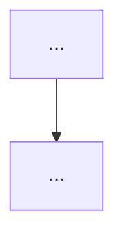

# Plan:

NOTE TO USER - SAVE PLAN TO WORKSPACE FIRST. USE .CURSOR/PLANS/ 

**Status:** draft | approved | executing | parked | done | superseded  
**Last updated:** YYYY-MM-DD  
**Owner:** <name/agent>  
**Related:** `DECISION_LOG.md#D-###`, PR #, Issue #

---

## Overview

## Scope

**In scope:**

- ...

**Out of scope:**

- ...

---

## Architecture (optional)




**Files touched:**

- ...

**Key interfaces / contracts:**

- ...

---

## Checkpoints

- **C0** — Baseline: build/compile + minimal smoke test
- **C1** — Core change: ...
- **C2** — Tests/fixtures: ...
- **C3** — Docs/decision log: ...

---

## Validation

**Tests to add/update:**

- ...

**Commands to run:**

```bash
# e.g. cargo test, npm run build
```

**Pass criteria:**

- ...

---

## Notes / Risks

- ...

---

## Retrospective (fill after checkpoints)

**What worked:**

- ...

**What didn't work:**

- ...

**Gaps identified:**

- ...

**Lessons learned:**

- ...

---

**Next review:** <date or trigger, e.g. "after C2" or "before PR merge">