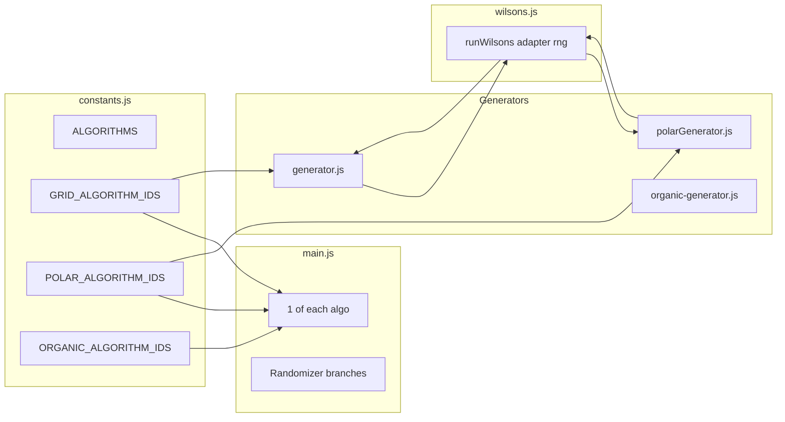

# Add Wilson's algorithm and layout-keyed algorithm pools

## Summary

- **Wilson's**: One shared implementation (loop-erased random walk) that works on grid and polar via a small adapter interface (enumerate cells, get adjacent neighbors, remove wall, mark visited).
- **Polar**: Add Wilson's; remove Prim from the pool (DFS + Kruskal + Wilson's). When preset or config requests `prim`, coerce to a polar-allowed default (e.g. `recursive-backtracker`).
- **Grid**: Add Wilson's to the existing pool (Prim, recursive-backtracker, Kruskal, Wilson's).
- **Organic**: Wilson's excluded — randomizer and "1 of each algorithm" use a pool that never includes Wilson's.
- **Constants and main.js**: Layout-keyed algorithm lists and use them everywhere the randomizer or "1 of each algorithm" chooses an algorithm.

---

## 1. Constants: algorithm id + layout-keyed pools

**File:** [src/utils/constants.js](src/utils/constants.js)

- Add `ALGORITHMS.WILSON = 'wilson'`.
- Keep `ALGORITHM_IDS = Object.values(ALGORITHMS)` as the full set (e.g. for footer label and any "all algorithms" reference).
- Add layout-keyed pools (no cross-contamination):
  - `**GRID_ALGORITHM_IDS**`: `['prim', 'recursive-backtracker', 'kruskal', 'wilson']`
  - `**POLAR_ALGORITHM_IDS**`: `['recursive-backtracker', 'kruskal', 'wilson']` (Prim excluded)
  - `**ORGANIC_ALGORITHM_IDS**`: `['recursive-backtracker', 'prim', 'kruskal']` (Wilson's excluded)
- Optionally add a helper, e.g. `getAlgorithmIdsForLayout(layout)` returning the correct array for `'grid' | 'polar' | 'organic'`, used by randomizers and "1 of each algorithm".

Presets stay as-is (grid/organic can still use Prim). Polar generator will coerce `prim` to a polar-allowed default when used for polar.

---

## 2. Shared Wilson's implementation

**New file:** `src/maze/wilsons.js`

- **Algorithm**: Start with one cell in the maze (e.g. first cell or random). Repeatedly pick a random unvisited cell, perform a loop-erased random walk until the walk hits the maze, then add the path (remove walls along it) and mark path cells visited. Stop when all cells are in the maze.
- **Interface**: Export a single function, e.g. `function runWilsons(adapter, rng)`, where the adapter is topology-agnostic:
  - `**getAllKeys()**` — returns an array of all cell keys (e.g. `['0,0','0,1',...]` for grid; `['0,0','1,0','1,1',...]` for polar).
  - `**getAdjacentKeys(key)**` — returns keys of all cells adjacent to `key` (neighbors regardless of wall state; used for the random walk).
  - `**removeWallBetween(key1, key2)**` — carve passage between two adjacent cells.
  - `**markVisited(key)**` — mark cell as part of the maze.
  - `**isVisited(key)**` — for "hit the maze" and "pick unvisited" steps.
- **Determinism**: Use only `rng` for all choices (pick random unvisited, pick random neighbor at each step). Same seed and adapter → same maze.
- No dependency on grid/polar/organic modules; only the adapter object.
- **Performance note (not a blocker)**: Wilson's can be slow on large grids because early random walks—when little of the maze is carved yet—can loop for a long time before hitting a visited cell. The plan does not add practical bounds or step limits; behavior remains correct. **Add a comment in `wilsons.js**` (e.g. at top of file or above `runWilsons`) so future maintainers know why generation might feel slow on big presets (e.g. 18+ grid). No code change required for v0.

---

## 3. Grid: Wilson's branch and adapter

**File:** [src/maze/generator.js](src/maze/generator.js)

- Import the shared Wilson's runner from `wilsons.js`.
- In `generateMaze(config)`, add branch: `if (algorithm === 'wilson')` then build a grid adapter and call the shared runner.
- **Grid adapter** (inline or local helper): key = `row,col`. `getAllKeys`: iterate `rows`×`cols`. `getAdjacentKeys(row,col)`: for each direction, call `grid.getNeighbor(row, col, dir)` and collect non-null keys. `removeWallBetween`: parse keys to (row,col), get cells, call `grid.removeWallBetween(cell1, cell2)`. `markVisited` / `isVisited`: delegate to `grid.getCell(...).markVisited()` / `isVisited()`.
- Grid already has `getNeighbor`, `getCell`, `removeWallBetween`, and cells have `markVisited`/`isVisited` — no new grid API required.
- `**generateMazes**`: When using the randomizer (`useAlgorithmRandomizerForOlderAges` and i > 0), draw from `GRID_ALGORITHM_IDS` instead of `ALGORITHM_IDS` (so grid randomizer includes Wilson's).

---

## 4. Polar: Wilson's branch, remove Prim from pool, coerce prim

**File:** [src/maze/polarGenerator.js](src/maze/polarGenerator.js)

- Import the shared Wilson's runner from `wilsons.js`.
- In `generatePolarMaze(config)`: If `algorithm === 'prim'`, coerce to a polar-allowed default (e.g. `'recursive-backtracker'`) so the first maze and explicit `algorithm: 'prim'` still produce a valid polar maze. Add `else if (algorithm === 'wilson')` and call shared Wilson's with a polar adapter.
- **Polar adapter**: key = `ring,wedge`. `getAllKeys`: loop rings, for each ring loop `wedgesAtRing(r)`. `getAdjacentKeys(ring, wedge)`: for each `POLAR_DIRECTIONS`, call `grid.getNeighbor(ring, wedge, dir)` and flatten the returned array to keys. `removeWallBetween`: parse keys to (ring, wedge), get cells, call `grid.removeWallBetween(cell1, cell2)`. `markVisited` / `isVisited`: delegate to `grid.getCell(ring, wedge)`.
- `**generatePolarMazes**`: Replace `ALGORITHM_IDS` with `POLAR_ALGORITHM_IDS` when using the randomizer (i > 0). Default/fallback for first maze when preset says `prim`: use polar default (e.g. `recursive-backtracker`) so polar never actually runs Prim.
- Polar grid already has `getNeighbor`, `getCell`, `removeWallBetween`, and cells have `markVisited`/`isVisited` — no new polarGrid API required.

---

## 5. Organic: no Wilson's in pool

**File:** [src/maze/organic-generator.js](src/maze/organic-generator.js)

- No Wilson's implementation for organic (Wilson's excluded per requirement).
- If `algorithm === 'wilson'` is ever passed (e.g. from a future UI bug), fallback to preset or `'recursive-backtracker'` and do not run Wilson's. No change to organic algorithm list inside this file; the pool is defined in constants and used by callers (main.js).

---

## 6. main.js: use layout-keyed algorithm lists

**File:** [src/main.js](src/main.js)

- Import `GRID_ALGORITHM_IDS`, `POLAR_ALGORITHM_IDS`, `ORGANIC_ALGORITHM_IDS` (or `getAlgorithmIdsForLayout`) from constants.
- **"1 of each algorithm"**:
  - When generating **grid** mazes (non-organic, non-circular): iterate `GRID_ALGORITHM_IDS` instead of `ALGORITHM_IDS`.
  - When generating **polar** (circular): iterate `POLAR_ALGORITHM_IDS` instead of `ALGORITHM_IDS`.
  - When generating **organic** (jagged/curvy): iterate `ORGANIC_ALGORITHM_IDS` instead of `ALGORITHM_IDS`.
- **"1 of each level"** grid branch that currently loops `ALGORITHM_IDS`: switch to `GRID_ALGORITHM_IDS` so each level gets one maze per grid algorithm (including Wilson's).
- No other branches need to change if they already use `generateMazes` / `generatePolarMazes` with randomizer; those generators will use the correct pool internally.

---

## 7. Renderer: Wilson's label

**File:** [src/pdf/renderer.js](src/pdf/renderer.js)

- In `formatAlgorithmLabel(algorithmId)`, add case for `'wilson'` (e.g. return `'Wilson\'s'` or `'Wilson'`) so the footer displays correctly.

---

## 8. Tests

- **Wilson's core**: Add `tests/wilsons.test.js` (or a section in an existing test file) that runs the shared `runWilsons` with a tiny grid adapter and a tiny polar adapter; assert all cells visited, correct cell count, and determinism (same seed → same maze by comparing walls or a fingerprint).
- **Polar**: In [tests/polarGenerator.test.js](tests/polarGenerator.test.js), add test that polar supports `algorithm: 'wilson'` and produces a perfect maze (all cells reachable); add test that polar randomizer only ever returns algorithms in `POLAR_ALGORITHM_IDS` (e.g. generate several with randomizer and assert algorithm is never `'prim'`). Optionally test that explicit `algorithm: 'prim'` for polar is coerced (e.g. maze still valid and algorithm in output may be the fallback).
- **Grid**: In [tests/maze.test.js](tests/maze.test.js) or generator test, add test that grid supports `algorithm: 'wilson'` and produces a perfect maze; optionally test grid randomizer includes Wilson's.
- **Constants**: Test or sanity-check that `POLAR_ALGORITHM_IDS` does not include `'prim'` and `ORGANIC_ALGORITHM_IDS` does not include `'wilson'`.

---

## Data flow (high level)

---

## File change list

| File                                                           | Change                                                                                                                                                 |
| -------------------------------------------------------------- | ------------------------------------------------------------------------------------------------------------------------------------------------------ |
| [src/utils/constants.js](src/utils/constants.js)               | Add WILSON; add GRID_ALGORITHM_IDS, POLAR_ALGORITHM_IDS, ORGANIC_ALGORITHM_IDS (and optional getAlgorithmIdsForLayout).                                |
| **New** `src/maze/wilsons.js`                                  | Shared loop-erased random walk; adapter interface; **comment**: can be slow on large grids (early walks may loop long before hitting maze).            |
| [src/maze/generator.js](src/maze/generator.js)                 | Import wilsons; add `wilson` branch; build grid adapter; randomizer uses GRID_ALGORITHM_IDS.                                                           |
| [src/maze/polarGenerator.js](src/maze/polarGenerator.js)       | Import wilsons; coerce `prim` to polar default; add `wilson` branch; polar adapter; randomizer uses POLAR_ALGORITHM_IDS.                               |
| [src/maze/organic-generator.js](src/maze/organic-generator.js) | If algorithm === 'wilson', fallback to preset/recursive-backtracker (no Wilson's run).                                                                 |
| [src/main.js](src/main.js)                                     | Import layout-keyed IDs; "1 of each algorithm" and "1 of each level" grid branch use GRID_ALGORITHM_IDS / POLAR_ALGORITHM_IDS / ORGANIC_ALGORITHM_IDS. |
| [src/pdf/renderer.js](src/pdf/renderer.js)                     | formatAlgorithmLabel: add 'wilson' → "Wilson's".                                                                                                       |
| **New** `tests/wilsons.test.js` (or existing)                  | Wilson's determinism and connectivity with grid and polar adapters.                                                                                    |
| [tests/polarGenerator.test.js](tests/polarGenerator.test.js)   | Wilson's support; polar pool excludes prim.                                                                                                            |
| Grid generator test                                            | Wilson's support and/or randomizer includes Wilson's.                                                                                                  |

---

## Checkpoints

- **C0**: Constants and layout-keyed pools; renderer label; no generator changes yet.
- **C1**: Shared Wilson's in wilsons.js + tests (adapter contract, determinism, connectivity).
- **C2**: Grid: Wilson's branch + adapter; generateMazes uses GRID_ALGORITHM_IDS; tests.
- **C3**: Polar: Wilson's branch + adapter; prim coercion; generatePolarMazes uses POLAR_ALGORITHM_IDS; tests.
- **C4**: main.js uses layout-keyed IDs for "1 of each algorithm" and "1 of each level"; organic fallback for wilson. ✓
- **C5**: Final validation (full test suite 158 tests pass; organic never gets Wilson's). ✓

