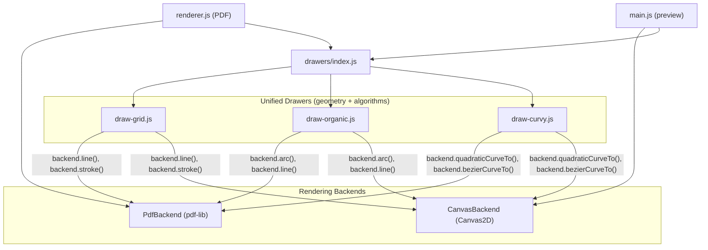

# Unify PDF and Canvas Drawing Backends

**Status:** built

## Problem

Every drawing style has two near-identical implementations: one calling `pdf-lib` (`page.drawLine`, `page.drawSvgPath`) and one calling `CanvasRenderingContext2D` (`ctx.moveTo`, `ctx.lineTo`, `ctx.stroke`). The geometry and algorithms are 90-100% duplicated; only the final draw calls differ.

**Affected file pairs (6 files of duplication):**

- [draw-organic.js](src/pdf/drawers/draw-organic.js) vs [draw-organic-canvas.js](src/pdf/drawers/draw-organic-canvas.js) (jagged)
- [draw-curvy.js](src/pdf/drawers/draw-curvy.js) vs [draw-curvy-canvas.js](src/pdf/drawers/draw-curvy-canvas.js)
- [draw-grid.js](src/pdf/drawers/draw-grid.js) vs [draw-grid-canvas.js](src/pdf/drawers/draw-grid-canvas.js)

## Approach: Rendering Backend Adapter

Introduce a `DrawBackend` interface with two implementations (`PdfBackend`, `CanvasBackend`). Each backend wraps its native API behind a common path-drawing contract. Drawers accept a `backend` instead of `page`/`ctx` and use backend methods for all rendering.

## Backend Interface

New file: `src/pdf/drawers/draw-backend.js`

The backend exposes a minimal set of drawing primitives that both PDF and canvas can implement:

- `**setStroke(color, width, lineCap)**` -- set stroke style for subsequent operations
- `**line(x1, y1, x2, y2)**` -- draw a single straight line segment (convenience; calls beginPath/moveTo/lineTo/stroke internally)
- `**beginPath()**` -- start a new path
- `**moveTo(x, y)**` -- move pen
- `**lineTo(x, y)**` -- line segment
- `**arc(cx, cy, r, startAngle, endAngle)**` -- circular arc
- `**quadraticCurveTo(cpx, cpy, x, y)**` -- quadratic Bezier (PDF backend converts to cubic SVG `C` internally)
- `**bezierCurveTo(cp1x, cp1y, cp2x, cp2y, x, y)**` -- cubic Bezier
- `**stroke()**` -- emit the accumulated path
- `**text(str, x, y, opts)**` -- draw text (opts differ: PDF takes `{font, fontSize, color}`, canvas takes `{fontCss, fillStyle}`)
- `**measureTextWidth(str, fontOrCss, fontSize)**` -- measure text width

### PdfBackend

Wraps `PDFPage`. Accumulates path segments into an SVG path string on `beginPath/moveTo/lineTo/arc/bezierCurveTo/quadraticCurveTo`. On `stroke()`, emits via `page.drawSvgPath(pathStr, svgOpts)`. For `line()`, uses `page.drawLine()` directly. For `arc()`, converts to SVG `A` commands. For `quadraticCurveTo()`, converts to cubic (the standard `2/3` rule) and emits `C`.

### CanvasBackend

Wraps `CanvasRenderingContext2D`. All methods are thin pass-throughs to the native canvas API. `line()` is `ctx.beginPath(); ctx.moveTo; ctx.lineTo; ctx.stroke()`.

## Labels Strategy

Labels have the most divergence between PDF and canvas (coordinate flipping, font API, text measurement). Two options:

- **Option A (recommended):** The backend `text()` and `measureTextWidth()` methods accept a backend-specific font handle (PDFFont for PDF, CSS string for canvas). Drawers receive the font handle via the `options` parameter (already the case). The canvas label code that flips to screen coordinates uses a `withScreenTransform(fn)` method on CanvasBackend.
- **Option B:** Keep labels as thin backend-specific wrappers that call shared positioning logic. This is the fallback if Option A introduces too much complexity for the text coordinate flip.

## Files Changed

**New file:**

- `src/pdf/drawers/draw-backend.js` -- `createPdfBackend(page)` and `createCanvasBackend(ctx)`

**Merged (PDF+canvas into one, taking `backend`):**

- `src/pdf/drawers/draw-grid.js` -- unified grid drawer
- `src/pdf/drawers/draw-organic.js` -- unified jagged drawer
- `src/pdf/drawers/draw-curvy.js` -- unified curvy drawer

**Deleted (replaced by unified drawers):**

- `src/pdf/drawers/draw-grid-canvas.js`
- `src/pdf/drawers/draw-organic-canvas.js`
- `src/pdf/drawers/draw-curvy-canvas.js`

**Updated callers:**

- `src/pdf/drawers/index.js` -- single `getDrawer(style)` (no more `getCanvasDrawer`); or keep `getCanvasDrawer` as alias returning the same drawer
- `src/pdf/renderer.js` -- create `PdfBackend`, pass to `drawer.drawWalls(backend, maze, layoutResult)`
- `src/main.js` -- create `CanvasBackend`, pass to `drawer.drawWalls(backend, maze, layoutResult)`

## Checkpoints

### C0: Draw-backend module with PdfBackend and CanvasBackend

Create `draw-backend.js` with both factory functions. Unit-level smoke check: create each backend and verify methods exist. No drawer changes yet.

### C1: Unify grid drawer

Merge `draw-grid.js` and `draw-grid-canvas.js` into a single `draw-grid.js` that takes `backend`. Update `index.js`, `renderer.js`, `main.js`. Delete `draw-grid-canvas.js`. Validate: PDF output and canvas preview for Classic and Square styles match prior behavior.

### C2: Unify jagged drawer

Merge `draw-organic.js` and `draw-organic-canvas.js` into a single `draw-organic.js` that takes `backend`. Delete `draw-organic-canvas.js`. Validate: Jagged style PDF and canvas preview match prior behavior.

### C3: Unify curvy drawer

Merge `draw-curvy.js` and `draw-curvy-canvas.js` into a single `draw-curvy.js` that takes `backend`. Delete `draw-curvy-canvas.js`. Validate: Curvy style PDF and canvas preview match prior behavior.

### C4: Clean up registry and callers

Remove `getCanvasDrawer` from `index.js` (or alias to `getDrawer`). Update `main.js` to use `getDrawer`. Final pass: verify all 4 styles work for both PDF and canvas. Update `docs/DECISIONS.md` with a decision entry.

### C5: Unify drawSolutionOverlay + canvas preview toggle

Extend the backend interface with `setDash(pattern)`, `setOpacity(value)`, `save()`, and `restore()`. These are needed by `drawSolutionOverlay` (dashed lines at 0.7 opacity) and were intentionally deferred from C0 to keep the initial interface minimal.

- **PdfBackend:** `setDash` stores dashArray for next `stroke()`; `setOpacity` stores opacity; `save`/`restore` push/pop a state stack of stroke style, dash, opacity.
- **CanvasBackend:** `setDash` calls `ctx.setLineDash(pattern)`; `setOpacity` sets `ctx.globalAlpha`; `save`/`restore` call `ctx.save()`/`ctx.restore()`.

Merge `drawSolutionOverlay` from `draw-grid.js` and `draw-organic.js` so they use backend methods instead of raw pdf-lib calls. This makes solution overlay work on both PDF and canvas with the same code.

In [src/main.js](src/main.js) `updatePreviewCanvas()`: when debug mode is on and the "Show solution" checkbox is checked, solve the maze and call `drawer.drawSolutionOverlay(backend, maze, solution.path, layoutResult)` on the canvas. The existing `debug-show-solution` checkbox (`src/index.html` line 151) and `change` listener already exist; just wire `updatePreviewCanvas` to read the checkbox and draw when checked.

Validate: toggle "Show solution" in debug mode and confirm the dashed path appears on the canvas preview for all 4 styles.

## Validation

- **Visual:** Generate PDFs for all 4 styles (Classic, Square, Jagged, Curvy) at multiple age ranges. Compare against pre-refactor PDFs (same seed should produce identical output).
- **Canvas preview:** Verify live preview renders correctly for all 4 styles.
- **Solution overlay on canvas:** In debug mode, check "Show solution" and verify the dashed solution path appears on the canvas preview for all 4 styles.
- **Determinism:** Same seed + style produces identical PDF bytes before and after refactor.
- **No new dependencies:** Pure refactor; no new npm packages.

## Extensibility Notes

This backend design accommodates known future features without interface changes:

- **Polar/circular mazes:** Just one `draw-polar.js` file (not two). Polar drawing uses `backend.arc()` for circumferential walls and `backend.line()` for radial walls -- both already in the interface. The [circular mazes plan](circular_mazes_implementation_f1dda3a0.plan.md) references `draw-polar-canvas.js` which will no longer be needed.
- **Corridor-following filler:** No drawer changes -- `drawGraphCorridors()` already handles filler graphs through the backend.
- **New generation algorithms:** Algorithms don't touch the drawing layer.
- **New rendering targets (e.g., SVG export):** Just add a third backend implementation; drawer code stays unchanged.
- **2.5D visual bridges:** May need `setFill()`/`fill()` for shadow effects (not in current interface). Can be added to the backend when bridges are implemented.
- `**arc()` semantic:** The backend uses center-based arcs `arc(cx, cy, r, startAngle, endAngle)` matching the Canvas API. PdfBackend converts internally to SVG endpoint-based `A` commands.

## Risks and Mitigations

- **SVG path accumulation for PDF arcs**: The jagged PDF drawer currently uses `page.drawSvgPath` with SVG `A` (arc) commands. The PdfBackend `arc()` method must reproduce this exactly. Mitigation: port the existing SVG arc string construction into the backend.
- **Curvy quadratic-to-cubic**: The PDF curvy drawer manually converts quadratic to cubic Bezier. Moving this into `PdfBackend.quadraticCurveTo()` is cleaner but must produce identical control points. Mitigation: extract the existing conversion math.
- **Canvas label y-flip**: Canvas labels flip to screen coords via `ctx.setTransform(1,0,0,1,0,0)`. The backend needs a `withScreenTransform` or similar mechanism. Mitigation: the canvas backend can expose this, and the label code checks for it.
- **Solution overlay parity**: The PDF organic solution overlay uses SVG `Q` (quadratic Bezier) for smooth paths. The canvas version will use `ctx.quadraticCurveTo`. Both should produce visually equivalent results but won't be pixel-identical due to rendering engine differences.

