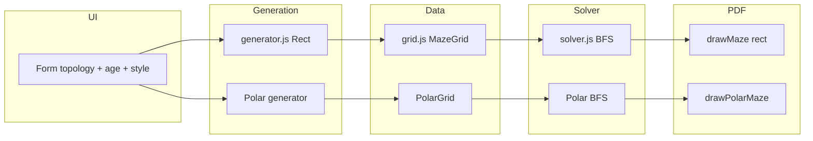

# Circular Mazes Implementation

**Status:** draft  
**Scope:** Polar/circular topology only. Out of scope: organic curves, silhouette masks, multiple start/finish positions.

---

## Scope

**In scope:**

- Polar maze data model: cells indexed by (ring, wedge). Rings are concentric (0 = center, outer = max ring). Wedges are radial segments (0 to numWedges-1). Each cell has up to 4 "walls": inward, outward, clockwise, counter-clockwise.
- Generation: Prim's algorithm on the polar graph (same RNG seed contract). Entrance at center (ring 0), exit at outer ring.
- PDF rendering: draw circumferential arcs and radial line segments using pdf-lib; fit circle in printable area; Start/Finish labels at center and outer edge.
- Solver: BFS on polar grid (neighbors by polar directions). Reuse validation contract (every maze solved before PDF).
- UI: Topology selector — "Rectangular" (default) / "Circular" — in [src/index.html](src/index.html). Form value passed through [src/main.js](src/main.js) into generator and renderer.
- Constants: Polar presets (e.g. rings + wedges per age range, or one circular preset) in [src/utils/constants.js](src/utils/constants.js).
- Determinism: Same seed + age range + topology → same maze. No new persistence or identifiers.
- Docs: Update [docs/DECISIONS.md](docs/DECISIONS.md) (circular topology in scope); note in [docs/DEFERRED_IDEAS.md](docs/DEFERRED_IDEAS.md) that polar mazes are implemented.

**Out of scope:**

- Organic/curvy paths (D-004: "Rounded" remains corner-only).
- Masked/silhouette shapes.
- Random start/finish positions.
- Changing v0 spec's "one maze per page" or "perfect maze only".

---

## Architecture



**Files to add:**

- `src/maze/polarGrid.js` — PolarCell, PolarGrid: rings × wedges; directions INWARD, OUTWARD, CW, CCW; getCell(ring, wedge), getNeighbor, removeWallBetween, openEntrance (center), openExit (outer ring).
- `src/maze/polarGenerator.js` — Prim's on PolarGrid (wall list = polar wall entries); export generatePolarMaze(config) and generatePolarMazes(config) with same config shape (ageRange, seed, quantity, baseSeed) where applicable.

**Files to modify:**

- [src/utils/constants.js](src/utils/constants.js) — Add polar presets (e.g. `POLAR_PRESETS` or extend presets with `rings`, `wedges` for topology `'circular'`). One preset per age band or single shared circular preset.
- [src/maze/solver.js](src/maze/solver.js) — Either: (a) add solvePolarMaze(polarGrid) and validatePolarMaze(polarGrid) using polar directions and polar start/finish, or (b) abstract a small interface (getNeighbor, hasWall, start, finish) and implement it for both grids so one BFS works. Option (b) reduces duplication; option (a) keeps rectangular solver untouched and is simpler for a first checkpoint.
- [src/pdf/renderer.js](src/pdf/renderer.js) — Accept topology in config. If topology === 'circular', use polar layout (center, maxRadius from printable area), call drawPolarMaze(page, polarGrid, options), drawPolarLabels; else keep current drawMaze + drawLabels. Arcs: use pdf-lib path APIs (moveTo, lineTo, or arc) for circumferential segments; radial walls as lines.
- [src/index.html](src/index.html) — Add "Maze Shape" or "Topology" fieldset with radio "Rectangular" (default) / "Circular".
- [src/main.js](src/main.js) — Read topology from form; call generateMazes vs generatePolarMazes and pass topology into renderMazesToPdf; ensure validation uses the correct solver for each maze type.
- [docs/DECISIONS.md](docs/DECISIONS.md) — New decision: circular (polar) topology supported; start at center, finish at outer ring.
- [docs/DEFERRED_IDEAS.md](docs/DEFERRED_IDEAS.md) — Note under "Polar / Circular Mazes" that this is now implemented (or remove that bullet).

**Key interfaces:**

- Polar grid: `getCell(ring, wedge)`, `getNeighbor(ring, wedge, direction)`, `removeWallBetween(cell1, cell2)`, `start` = { ring: 0, wedge: 0 }, `finish` = { ring: rings-1, wedge: chosenWedge } (e.g. 0 for simplicity). Same `hasWall(direction)` and `resetVisited()`-style contract for solver.
- Generator output: `{ grid, seed, ageRange, preset, topology: 'circular', rows?, cols? }` or reuse same shape with grid being either MazeGrid or PolarGrid (renderer and main.js branch on topology or grid type).
- Renderer: `drawPolarMaze(page, grid, { centerX, centerY, maxRadius, lineThickness, style })`; polar preset may define lineThickness (reuse age-based preset for labels and thickness).

---

## Checkpoints

- **C0** — Polar grid and generator: implement [src/maze/polarGrid.js](src/maze/polarGrid.js) and [src/maze/polarGenerator.js](src/maze/polarGenerator.js); add polar presets (rings, wedges) to constants; unit test polar generation (determinism, all cells reachable, entrance/exit open). No UI or PDF yet.
- **C1** — Polar solver and validation: implement polar BFS in [src/maze/solver.js](src/maze/solver.js) (e.g. solvePolarMaze, validatePolarMaze); wire validation in main.js for circular topology; unit test solve/validate on polar mazes.
- **C2** — PDF polar rendering: in [src/pdf/renderer.js](src/pdf/renderer.js) add polar layout and drawPolarMaze (arcs + radial lines), drawPolarLabels; branch on topology in renderMazesToPdf; test PDF with circular topology (manual or e2e).
- **C3** — UI and integration: add topology selector in [src/index.html](src/index.html); in [src/main.js](src/main.js) read topology, call polar generator when "circular", pass topology to renderer; update docs (DECISIONS, DEFERRED_IDEAS). Full flow: select Circular → Generate → PDF with one circular maze per page.

---

## Validation

**Tests:**

- New or extended in `tests/`: polarGrid (dimensions, walls, start/finish, removeWallBetween); polarGenerator (determinism for fixed seed, perfect maze); solver (solvePolarMaze, validatePolarMaze).
- Existing rectangular tests must still pass.
- E2E: optional add to [e2e/generate-pdf.spec.js](e2e/generate-pdf.spec.js) a case that generates PDF with circular topology and checks page count / no crash.

**Commands:**

```bash
npm run build
npm run test
# optional: npx playwright test
```

**Pass criteria:**

- Build succeeds; all existing tests pass; new polar tests pass; same seed produces same polar maze; every generated polar maze validates (solvePolarMaze succeeds); PDF with circular selection opens and shows polar maze and labels.

---

## Notes / Risks

- pdf-lib arc drawing: confirm API for arcs (e.g. `page.drawLine` for radial segments; for arcs may need `page.drawSvgPath` or construct path from arcs). If arcs are cumbersome, consider approximating with short line segments (vector, not raster).
- Center cell (ring 0): typically one "cell" (full circle); wedge count only applies from ring 1 outward. Define PolarGrid so ring 0 has one logical cell and opening it creates the entrance; outer ring has numWedges cells and one chosen exit wedge.
- Edge case: 1 ring (only center) is degenerate; presets should use at least 2 rings (e.g. center + one ring) or 3+ for a real maze.
