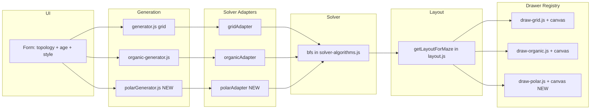

# Circular Mazes Implementation

**Status:** draft — approved scope per v1 spec  
**Spec:** [v1_spec.md](.cursor/plans/v1_spec.md) (see "Circular (Polar) Topology" section)  
**Related:** D-010 (solver/renderer adapter pattern), D-004 (style naming), D-001 (algorithms)  
**Scope:** Polar/circular topology only. Random start/finish on polar mazes is a separate v1 effort (see v1_spec.md).

---

## Scope

**In scope:**

- Polar maze data model: cells indexed by (ring, wedge). Rings are concentric (0 = center, outer = max ring). Wedges are radial segments (0 to numWedges-1). Each cell has up to 4 "walls": inward, outward, clockwise, counter-clockwise.
- Generation: Prim's algorithm on the polar graph (same seeded RNG contract as grid/organic). Entrance at center (ring 0), exit at outer ring (wedge 0 for fixed mode).
- Solver: BFS via a new **polar adapter** in [src/maze/solver-adapters.js](src/maze/solver-adapters.js), implementing the existing contract (`getStart`, `getFinish`, `getNeighbors`, `key`, `getTotalCells?`). No changes to `solver-algorithms.js` or the BFS implementation.
- PDF rendering: new **polar drawer** (`draw-polar.js`) and **polar canvas drawer** (`draw-polar-canvas.js`) registered in [src/pdf/drawers/index.js](src/pdf/drawers/index.js). Draw circumferential arcs and radial line segments using pdf-lib vector paths; fit circle in printable area; Start/Finish labels at center and outer edge.
- Layout: new `'polar'` branch in [src/pdf/layout.js](src/pdf/layout.js) `getLayoutForMaze()`, returning `centerX`, `centerY`, `maxRadius`, `lineThickness`, and `layoutType: 'polar'`.
- Canvas preview: polar drawer follows the same pattern as grid/organic canvas drawers — same `layoutResult`, draws via `CanvasRenderingContext2D`.
- UI: Topology selector — "Rectangular" (default) / "Circular" — in [src/index.html](src/index.html). When "Circular" is selected, the Maze Style control (Classic/Organic/Square) is hidden or disabled (polar is a single visual style). Form value passed through [src/main.js](src/main.js) into generator, solver adapter dispatch, and renderer.
- Constants: Extend `DIFFICULTY_PRESETS` in [src/utils/constants.js](src/utils/constants.js) with polar-specific fields (`polarRings`, `polarBaseWedges`) per age range.
- Determinism: Same seed + age range + topology → same maze. No new persistence or identifiers.
- Docs: New decision in [docs/DECISIONS.md](docs/DECISIONS.md) for polar topology. Update [docs/DEFERRED_IDEAS.md](docs/DEFERRED_IDEAS.md) to mark polar mazes as implemented.

**Out of scope:**

- Masked/silhouette shapes.
- Random start/finish positions (separate v1 plan; this plan uses fixed start/finish only).
- A4 page-size auto-detection (separate v1 feature; polar layout will accept configurable page dimensions from `getLayoutForMaze`).
- Changing "one maze per page" or "perfect maze only" invariants.

---

## Architecture

The codebase already has pluggable patterns for solver and renderer (D-010). Polar topology plugs into both without modifying existing grid/organic code paths.




**Files to add:**

- `src/maze/polarGrid.js` — `PolarCell`, `PolarGrid` classes. Rings x wedges; directions `INWARD`, `OUTWARD`, `CW`, `CCW`; `getCell(ring, wedge)`, `getNeighbors(ring, wedge)`, `removeWallBetween(cell1, cell2)`, `openEntrance()` (center), `openExit(wedge)` (outer ring). Ring 0 is a single center cell; wedge count may increase in outer rings.
- `src/maze/polarGenerator.js` — Prim's on `PolarGrid` (wall list = polar wall entries); exports `generatePolarMaze(config)` and `generatePolarMazes(config)` with same config shape as grid generator (`{ ageRange, seed, quantity, baseSeed }`). Returns maze object with `layout: 'polar'`.
- `src/pdf/drawers/draw-polar.js` — PDF drawer: `drawWalls(page, maze, layoutResult)`, `drawLabels(page, maze, layoutResult, options)`, `drawSolutionOverlay(page, maze, layoutResult, solution)`. Uses pdf-lib path APIs for arcs and radial lines.
- `src/pdf/drawers/draw-polar-canvas.js` — Canvas drawer (same interface as `draw-grid-canvas.js`): `drawWalls(ctx, maze, layoutResult)`, `drawLabels(ctx, maze, layoutResult, options)`. Uses `CanvasRenderingContext2D` arc/line APIs.

**Files to modify:**

- [src/maze/solver-adapters.js](src/maze/solver-adapters.js) — Add `polarAdapter(maze)` implementing `{ getStart, getFinish, getNeighbors, key, getTotalCells }`. Register in `getAdapterForMaze()` with `layout === 'polar'` branch. No changes to `solver-algorithms.js` or BFS.
- [src/pdf/layout.js](src/pdf/layout.js) — Add `'polar'` branch in `getLayoutForMaze()`. Returns `{ layoutType: 'polar', centerX, centerY, maxRadius, lineThickness, rings, baseWedges }`. Computes `maxRadius` from `min(printableW, printableH) / 2` minus label clearance.
- [src/pdf/drawers/index.js](src/pdf/drawers/index.js) — Import and register `draw-polar.js` and `draw-polar-canvas.js` in `drawers` and `canvasDrawers` maps under key `'polar'`.
- [src/pdf/renderer.js](src/pdf/renderer.js) — No structural change needed; the drawer registry dispatch already selects by `layoutType`. Ensure polar maze objects pass through cleanly (topology in config, layout type from `getLayoutForMaze`).
- [src/utils/constants.js](src/utils/constants.js) — Extend each `DIFFICULTY_PRESETS` entry with `polarRings` and `polarBaseWedges`. Example: age 3 gets 3 rings / 4 wedges; age 18+ gets 14 rings / 8 wedges. Line thickness reuses existing per-age values.
- [src/index.html](src/index.html) — Add "Maze Topology" fieldset with radio "Rectangular" (default) / "Circular". When "Circular" is selected, Maze Style toggles (Classic/Organic/Square) are hidden or disabled.
- [src/main.js](src/main.js) — Read topology from form; call `generatePolarMazes` when topology is `'circular'`, else existing generator. Solver dispatch is automatic via `getAdapterForMaze()` (branches on `maze.layout`). Pass topology context to renderer. Update live preview to handle polar mazes.
- [docs/DECISIONS.md](docs/DECISIONS.md) — New decision (D-014 or next): circular (polar) topology supported in v1; start at center, finish at outer ring.
- [docs/DEFERRED_IDEAS.md](docs/DEFERRED_IDEAS.md) — Update "Polar / Circular Mazes" entry to note it is implemented in v1.

**Key interfaces (aligned with existing patterns):**

- **Polar adapter** (for `solver-adapters.js`):
  - `getStart()` → `{ ring: 0, wedge: 0 }`
  - `getFinish()` → `{ ring: maxRing, wedge: exitWedge }`
  - `getNeighbors(state)` → array of `{ ring, wedge }` reachable from state (no wall between)
  - `key(state)` → `"ring,wedge"` string
  - `getTotalCells()` → total cell count across all rings
- **Generator output** (maze object): `{ layout: 'polar', polarGrid, seed, ageRange, preset, start, finish }`. The `polarGrid` is the `PolarGrid` instance. `layout: 'polar'` triggers the correct adapter in `getAdapterForMaze()` and the correct drawer in `getDrawer()`/`getCanvasDrawer()`.
- **Layout result** (from `getLayoutForMaze`): `{ layoutType: 'polar', centerX, centerY, maxRadius, lineThickness }`. Drawers use this to compute arc positions and radii per ring.

---

## Checkpoints

- **C0** — Polar grid, generator, and presets
  - Implement `src/maze/polarGrid.js` (PolarCell, PolarGrid) and `src/maze/polarGenerator.js` (Prim's on polar graph).
  - Add `polarRings` and `polarBaseWedges` to each entry in `DIFFICULTY_PRESETS` in [src/utils/constants.js](src/utils/constants.js).
  - Unit tests in `tests/polarGrid.test.js` and `tests/polarGenerator.test.js`: determinism for fixed seed, all cells reachable, entrance/exit open, correct ring/wedge dimensions.
  - No UI, solver, or rendering yet.
- **C1** — Polar solver adapter
  - Add `polarAdapter(maze)` to [src/maze/solver-adapters.js](src/maze/solver-adapters.js); register in `getAdapterForMaze()` under `layout === 'polar'`.
  - Unit tests in `tests/solver.test.js` (extend existing): solve a polar maze, validate it (single solution, all cells reachable).
  - Existing grid and organic solver tests must still pass unchanged.
- **C2** — Polar rendering (PDF + canvas)
  - Add `'polar'` branch in [src/pdf/layout.js](src/pdf/layout.js) `getLayoutForMaze()`.
  - Implement `src/pdf/drawers/draw-polar.js` (PDF) and `src/pdf/drawers/draw-polar-canvas.js` (canvas preview).
  - Register both in [src/pdf/drawers/index.js](src/pdf/drawers/index.js).
  - Test: generate a polar maze programmatically, render to PDF, verify PDF has content (byte length, page count). Manual visual check of output.
- **C3** — UI integration and docs
  - Add "Maze Topology" fieldset in [src/index.html](src/index.html) with "Rectangular" (default) / "Circular" radios.
  - In [src/main.js](src/main.js): read topology from form, call `generatePolarMazes` when circular, hide/disable Maze Style when circular is selected, update live canvas preview for polar.
  - Update [docs/DECISIONS.md](docs/DECISIONS.md) with new polar topology decision.
  - Update [docs/DEFERRED_IDEAS.md](docs/DEFERRED_IDEAS.md) to mark polar mazes as implemented.
  - Full flow: select Circular → see live polar preview → Generate → PDF with one circular maze per page.

---

## Validation

**Tests to add:**

- `tests/polarGrid.test.js` — PolarGrid construction (ring/wedge counts), wall state, `getCell`, `removeWallBetween`, center cell (ring 0) has 1 cell, outer ring has expected wedge count.
- `tests/polarGenerator.test.js` — Determinism (same seed → same maze), all cells reachable (no isolated cells), entrance/exit open.
- `tests/solver.test.js` (extend) — `solveMaze` on a polar maze object returns a valid path from center to outer edge; `validateMaze` passes.
- `tests/layout.test.js` (extend) — `getLayoutForMaze` returns `layoutType: 'polar'` with `centerX`, `centerY`, `maxRadius` for a polar maze.
- `tests/pdf.test.js` (extend) — Render a polar maze to PDF; verify `Uint8Array` with length > 1000.
- Existing grid and organic tests must still pass unchanged.
- E2E (optional): add a case to [e2e/generate-pdf.spec.js](e2e/generate-pdf.spec.js) that selects Circular topology and generates a PDF.

**Commands:**

```bash
npm run test
npm run build
# optional: npx playwright test
```

**Pass criteria:**

- Build succeeds with no errors.
- All existing tests pass (no regressions).
- New polar tests pass: determinism, solver validation, layout, PDF rendering.
- Same seed + age range + topology 'circular' → same polar maze across runs.
- Live canvas preview displays polar maze when Circular topology is selected.
- Generated PDF opens and shows circular maze with Start/Finish labels.

---

## Notes / Risks

- **pdf-lib arc drawing:** pdf-lib does not have a native `arc()` API. Options: (a) use `page.drawSvgPath()` with SVG arc commands (`A`), or (b) approximate arcs with short line segments (still vector, not raster). Option (a) is cleaner if pdf-lib supports the SVG arc command; verify early in C2. The canvas drawer can use native `ctx.arc()`.
- **Center cell (ring 0):** One logical cell (full circle); wedge count only applies from ring 1 outward. `PolarGrid` should define ring 0 as having 1 cell. Opening the entrance means removing the wall between ring 0 and ring 1 at the start wedge.
- **Wedge subdivision in outer rings:** To keep cell proportions printable, outer rings may have 2x the wedge count of inner rings. The `PolarGrid` must handle variable wedge counts per ring and map neighbor relationships across ring boundaries where wedge counts differ (one cell inward maps to two cells outward, etc.).
- **Edge case:** Presets must use at least 3 rings (center + 2) for a meaningful maze. Age 3 preset should be small but not degenerate.
- **Interaction with other v1 features:** This plan does not implement random start/finish or A4 page detection. However, the polar layout in `layout.js` should accept configurable `pageWidth`/`pageHeight` (as grid/organic already do) so A4 support is a pass-through when that feature lands.
- **Existing patterns:** The solver adapter pattern (D-010) and drawer registry (`drawers/index.js`) were designed for exactly this kind of extension. No changes to existing adapters or drawers are needed; only additions.

