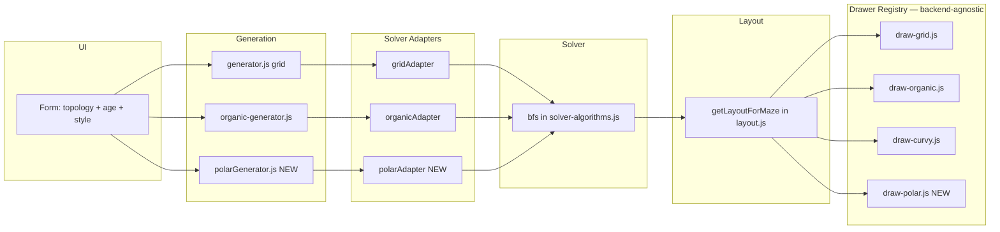

# Circular Mazes Implementation

**Status:** executing — C0–C3 done  
**Spec:** [v1_spec.md](.cursor/plans/v1_spec.md) (see "Circular (Polar) Topology" section)  
**Related:** D-010 (solver/renderer adapter pattern), D-004 (style naming), D-001 (algorithms)  
**Scope:** Polar/circular topology only. Random start/finish on polar mazes is a separate v1 effort (see v1_spec.md).

---

## Scope

**In scope:**

- Polar maze data model: cells indexed by (ring, wedge). Rings are concentric (0 = center, outer = max ring). Wedges are radial segments (0 to numWedges-1). Each cell has up to 4 "walls": inward, outward, clockwise, counter-clockwise.
- Generation: Prim's algorithm on the polar graph (same seeded RNG contract as grid/organic). Entrance at center (ring 0), exit at outer ring (wedge 0 for fixed mode).
- Solver: BFS via a new **polar adapter** in [src/maze/solver-adapters.js](src/maze/solver-adapters.js), implementing the existing contract (`getStart`, `getFinish`, `getNeighbors`, `key`, `getTotalCells?`). No changes to `solver-algorithms.js` or the BFS implementation.
- PDF rendering: new **polar drawer** (`draw-polar.js`) — a single backend-agnostic drawer like grid/jagged/curvy. It implements `drawWalls(backend, maze, layoutResult)`, `drawLabels(backend, ...)`, `drawSolutionOverlay(backend, ...)` using the shared [DrawBackend](src/pdf/drawers/draw-backend.js) (caller passes `createPdfBackend(page, fonts)` or `createCanvasBackend(ctx)`). Draw circumferential arcs and radial line segments via backend path APIs; fit circle in printable area; Start/Finish labels at center and outer edge. Registered under key `'polar'` in [src/pdf/drawers/index.js](src/pdf/drawers/index.js). No separate canvas-only file.
- Layout: new `'polar'` branch in [src/pdf/layout.js](src/pdf/layout.js) `getLayoutForMaze()`, returning `centerX`, `centerY`, `maxRadius`, `lineThickness`, and `layoutType: 'polar'`.
- Canvas preview: same polar drawer with `createCanvasBackend(ctx)`; [src/main.js](src/main.js) uses `getDrawer('polar')` when topology is circular and passes the canvas backend.
- UI: Topology selector — "Rectangular" (default) / "Circular" — in [src/index.html](src/index.html). When "Circular" is selected, the Maze Style control (Classic / Jagged / Curvy / Square Corners) is hidden or disabled (polar is a single visual style). Form value passed through [src/main.js](src/main.js) into generator, solver adapter dispatch, and renderer.
- Constants: Extend `DIFFICULTY_PRESETS` in [src/utils/constants.js](src/utils/constants.js) with polar-specific fields (`polarRings`, `polarBaseWedges`) per age range.
- Determinism: Same seed + age range + topology → same maze. No new persistence or identifiers.
- Docs: New decision in [docs/DECISIONS.md](docs/DECISIONS.md) for polar topology. Update [docs/DEFERRED_IDEAS.md](docs/DEFERRED_IDEAS.md) to mark polar mazes as implemented.

**Out of scope:**

- Masked/silhouette shapes.
- Random start/finish positions (separate v1 plan; this plan uses fixed start/finish only).
- A4 page-size auto-detection (separate v1 feature; polar layout will accept configurable page dimensions from `getLayoutForMaze`).
- Changing "one maze per page" or "perfect maze only" invariants.

---

## Pre-implementation: architectural suggestions

Consider these before starting implementation; they reduce duplication and keep polar integration in one place.

1. **Single source for drawer key**
  Drawer key is currently computed in two places: [src/pdf/renderer.js](src/pdf/renderer.js) (`maze.layout === 'organic' ? ... : 'grid'`) and [src/main.js](src/main.js) (`isOrganic ? style : 'grid'`). When adding polar, both would need the same third branch. **Suggestion:** Add `getDrawerKey(maze, style)` in [src/pdf/drawers/index.js](src/pdf/drawers/index.js) (or a small shared util), e.g. `if (maze.layout === 'polar') return 'polar'; if (maze.layout === 'organic') return style === 'curvy' ? 'curvy' : 'jagged'; return 'grid';`. Use it from renderer and main so polar is wired in one place.
2. **Preview seed and topology**
  Preview seed is currently `previewSeedFor(ageRange, mazeStyle)`. For Circular topology there is no style. **Suggestion:** Include topology in the seed input so the same polar maze appears for the same age when Circular is selected, e.g. `previewSeedFor(ageRange, topology === 'circular' ? 'polar' : mazeStyle)`. Ensures deterministic preview and avoids reusing a rectangular style key for polar.
3. **Naming: topology vs layout**
  Keep a clear mapping: UI "topology" (Rectangular / Circular) → `maze.layout` (`'grid' | 'organic' | 'polar'`). Rectangular uses style (classic/jagged/curvy/square); Circular has a single visual style. Document in code or DECISIONS that `layout` is the topology identifier on the maze object.
4. **Preset shape**
  Polar will add `polarRings` and `polarBaseWedges` to `DIFFICULTY_PRESETS`. Reuse `lineThickness` from the same preset (or override if needed). Generator always receives the same preset object; polar generator reads only the polar-specific fields. No new pattern—just keep preset extension consistent.
5. **Debug overlay and footer**
  [src/main.js](src/main.js) `drawPreviewDebugOverlay` currently handles only organic. For polar, C2 can ship without a polar-specific overlay (or a minimal one, e.g. ring/wedge labels) and add it in a follow-up. Footer in renderer already branches on `maze.layout === 'organic'` for stats; polar can pass optional stats (e.g. rings, wedges) for debug footer or omit and keep footer minimal.
6. **v1 spec wording**
  [v1_spec.md](.cursor/plans/v1_spec.md) still says Maze Style "Organic" for rectangular; the app has split to **Jagged** and **Curvy**. When touching v1 spec for polar, consider updating that line to "Jagged, Curvy" for consistency with the UI.

---

## Architecture

The codebase already has pluggable patterns for solver and renderer (D-010). Polar topology plugs into both without modifying existing grid/organic code paths.


```mermaid
flowchart LR
  subgraph ui [UI]
    Form["Form: topology + age + style"]
  end
  subgraph gen [Generation]
    GenGrid[generator.js grid]
    GenOrganic[organic-generator.js]
    GenPolar[polarGenerator.js NEW]
  end
  subgraph adapters [Solver Adapters]
    AdapterGrid[gridAdapter]
    AdapterOrganic[organicAdapter]
    AdapterPolar[polarAdapter NEW]
  end
  subgraph solver [Solver]
    BFS["bfs in solver-algorithms.js"]
  end
  subgraph layout [Layout]
    LayoutFn["getLayoutForMaze in layout.js"]
  end
  subgraph drawers [Drawer Registry — backend-agnostic]
    DrawGrid[draw-grid.js]
    DrawJagged[draw-organic.js]
    DrawCurvy[draw-curvy.js]
    DrawPolar[draw-polar.js NEW]
  end
  Form --> GenGrid
  Form --> GenOrganic
  Form --> GenPolar
  GenGrid --> AdapterGrid
  GenOrganic --> AdapterOrganic
  GenPolar --> AdapterPolar
  AdapterGrid --> BFS
  AdapterOrganic --> BFS
  AdapterPolar --> BFS
  BFS --> LayoutFn
  LayoutFn --> DrawGrid
  LayoutFn --> DrawJagged
  LayoutFn --> DrawCurvy
  LayoutFn --> DrawPolar
```


**Files to add:**

- `src/maze/polarGrid.js` — `PolarCell`, `PolarGrid` classes. Rings x wedges; directions `INWARD`, `OUTWARD`, `CW`, `CCW`; `getCell(ring, wedge)`, `getNeighbors(ring, wedge)`, `removeWallBetween(cell1, cell2)`, `openEntrance()` (center), `openExit(wedge)` (outer ring). Ring 0 is a single center cell; wedge count may increase in outer rings.
- `src/maze/polarGenerator.js` — Prim's on `PolarGrid` (wall list = polar wall entries); exports `generatePolarMaze(config)` and `generatePolarMazes(config)` with same config shape as grid generator (`{ ageRange, seed, quantity, baseSeed }`). Returns maze object with `layout: 'polar'`.
- `src/pdf/drawers/draw-polar.js` — Single backend-agnostic drawer (same contract as [draw-grid.js](src/pdf/drawers/draw-grid.js), [draw-organic.js](src/pdf/drawers/draw-organic.js), [draw-curvy.js](src/pdf/drawers/draw-curvy.js)): `drawWalls(backend, maze, layoutResult)`, `drawLabels(backend, maze, layoutResult, options)`, `drawSolutionOverlay(backend, maze, solution.path, layoutResult)`. Uses backend path APIs (`line`, `arc`, `moveTo`, `lineTo`, `stroke`, etc.) for circumferential arcs and radial segments. No separate canvas file.

**Files to modify:**

- [src/maze/solver-adapters.js](src/maze/solver-adapters.js) — Add `polarAdapter(maze)` implementing `{ getStart, getFinish, getNeighbors, key, getTotalCells }`. Register in `getAdapterForMaze()` with `layout === 'polar'` branch. No changes to `solver-algorithms.js` or BFS.
- [src/pdf/layout.js](src/pdf/layout.js) — Add `'polar'` branch in `getLayoutForMaze()`. Returns `{ layoutType: 'polar', centerX, centerY, maxRadius, lineThickness, rings, baseWedges }`. Computes `maxRadius` from `min(printableW, printableH) / 2` minus label clearance.
- [src/pdf/drawers/index.js](src/pdf/drawers/index.js) — Import and register `draw-polar.js` in the single `drawers` map under key `'polar'`. No separate canvas drawer map (unified backend: callers use `getDrawer('polar')` and pass `createPdfBackend` or `createCanvasBackend`).
- [src/pdf/renderer.js](src/pdf/renderer.js) — Extend drawer key logic: when `maze.layout === 'polar'` use `drawerKey = 'polar'`; otherwise keep current logic (`'organic'` → `style === 'curvy' ? 'curvy' : 'jagged'`, else `'grid'`). Continue using `createPdfBackend(page, { font, boldFont })` and calling `drawer.drawWalls(backend, ...)`, `drawer.drawLabels(backend, ...)`, `drawer.drawSolutionOverlay(backend, ...)`.
- [src/utils/constants.js](src/utils/constants.js) — Extend each `DIFFICULTY_PRESETS` entry with `polarRings` and `polarBaseWedges`. Example: age 3 gets 3 rings / 4 wedges; age 18+ gets 14 rings / 8 wedges. Line thickness reuses existing per-age values.
- [src/index.html](src/index.html) — Add "Maze Topology" fieldset with radio "Rectangular" (default) / "Circular". When "Circular" is selected, Maze Style toggles (Classic / Jagged / Curvy / Square Corners) are hidden or disabled.
- [src/main.js](src/main.js) — Read topology from form; call `generatePolarMazes` when topology is `'circular'`, else existing generator. Solver dispatch is automatic via `getAdapterForMaze()` (branches on `maze.layout`). Pass topology context to renderer. For live preview: when topology is circular, use `getDrawer('polar')` and `createCanvasBackend(ctx)` (same pattern as grid/organic: one drawer, backend chosen by caller).
- [docs/DECISIONS.md](docs/DECISIONS.md) — New decision (D-014 or next): circular (polar) topology supported in v1; start at center, finish at outer ring.
- [docs/DEFERRED_IDEAS.md](docs/DEFERRED_IDEAS.md) — Update "Polar / Circular Mazes" entry to note it is implemented in v1.

**Key interfaces (aligned with existing patterns):**

- **Polar adapter** (for `solver-adapters.js`):
  - `getStart()` → `{ ring: 0, wedge: 0 }`
  - `getFinish()` → `{ ring: maxRing, wedge: exitWedge }`
  - `getNeighbors(state)` → array of `{ ring, wedge }` reachable from state (no wall between)
  - `key(state)` → `"ring,wedge"` string
  - `getTotalCells()` → total cell count across all rings
- **Generator output** (maze object): `{ layout: 'polar', polarGrid, seed, ageRange, preset, start, finish }`. The `polarGrid` is the `PolarGrid` instance. `layout: 'polar'` triggers the correct adapter in `getAdapterForMaze()` and the correct drawer via `getDrawer('polar')` (single registry; caller supplies PdfBackend or CanvasBackend).
- **Layout result** (from `getLayoutForMaze`): `{ layoutType: 'polar', centerX, centerY, maxRadius, lineThickness }`. Drawer uses this to compute arc positions and radii per ring.

---

## Checkpoints

- **C0** — Polar grid, generator, and presets ✅
  - Implemented `src/maze/polarGrid.js` (PolarCell, PolarGrid; fixed wedges per ring) and `src/maze/polarGenerator.js` (Prim's on polar graph).
  - Added `polarRings` and `polarBaseWedges` to each entry in `DIFFICULTY_PRESETS`.
  - Unit tests in `tests/polarGrid.test.js` and `tests/polarGenerator.test.js`: 15 tests, all passing (determinism, reachability, entrance/exit).
  - No UI, solver, or rendering yet.
- **C1** — Polar solver adapter ✅
  - Added `polarAdapter(maze)` to [src/maze/solver-adapters.js](src/maze/solver-adapters.js); registered in `getAdapterForMaze()` under `layout === 'polar'`.
  - Unit tests in `tests/solver.test.js`: "Polar maze solver" describe — solve from center to outer edge, validateMaze, isPerfectMaze. Grid and organic tests unchanged.
- **C2** — Polar rendering (PDF + canvas) ✅
  - Added `'polar'` branch in [src/pdf/layout.js](src/pdf/layout.js) returning `centerX`, `centerY`, `maxRadius`, `rings`, `wedges`.
  - Implemented [src/pdf/drawers/draw-polar.js](src/pdf/drawers/draw-polar.js): arcs and radials via backend `line`/`arc`, Start at center and Finish at outer wedge 0, solution overlay from path `{ring, wedge}`.
  - Registered polar drawer; added `getDrawerKey(maze, style)` in [src/pdf/drawers/index.js](src/pdf/drawers/index.js); renderer and main use it for drawer selection.
  - Tests: layout.test.js (polar layout), pdf.test.js (polar PDF render + determinism). All 131 tests pass.
- **C3** — UI integration and docs ✅
  - Added "Maze Topology" fieldset in [src/index.html](src/index.html) with "Rectangular" (default) / "Circular" radios; Maze Style fieldset gets `id="maze-style-fieldset"` and is disabled (class `topology-disabled`, `aria-hidden`) when Circular is selected via [syncMazeStyleVisibility()](src/main.js).
  - In [src/main.js](src/main.js): `getFormValues()` includes `topology`; `previewSeedFor(ageRange, mazeStyle, topology)` uses `'polar'` when circular; preview generates polar maze when circular and uses polar drawer; `generateAndDownload` branches on `topology === 'circular'` (normal, oneOfEachLevel, oneOfEachAlgo); `updateDebugPanel` shows "polar, N rings × M wedges" for polar mazes.
  - [docs/DECISIONS.md](docs/DECISIONS.md): D-016 — Circular (polar) maze topology.
  - [docs/DEFERRED_IDEAS.md](docs/DEFERRED_IDEAS.md): Polar / Circular Mazes marked as implemented (v1).
  - Full flow: select Circular → live polar preview → Generate → PDF with circular mazes.
- **C4** — Variable wedges + cleanup (after C3)
  - **Variable wedges:** Extend `PolarGrid` so outer rings can have 2× (or configurable) wedge count vs inner rings; map neighbor relationships across ring boundaries (one inner cell ↔ two outer cells where wedge counts differ). Update `polarGenerator.js` and presets (e.g. `polarWedgeMultiplier` or per-ring wedge counts). Tests: polarGrid and polarGenerator with variable wedges; solver and drawer still work.
  - **Cleanup:** Extract `getDrawerKey(maze, style)` in [src/pdf/drawers/index.js](src/pdf/drawers/index.js) and use from renderer and main (single place for drawer selection). Optional: polar debug overlay in preview (ring/wedge labels) or minimal footer stats; document in DECISIONS if added.

---

## Validation

**Tests to add:**

- `tests/polarGrid.test.js` — PolarGrid construction (ring/wedge counts), wall state, `getCell`, `removeWallBetween`, center cell (ring 0) has 1 cell, outer ring has expected wedge count.
- `tests/polarGenerator.test.js` — Determinism (same seed → same maze), all cells reachable (no isolated cells), entrance/exit open.
- `tests/solver.test.js` (extend) — `solveMaze` on a polar maze object returns a valid path from center to outer edge; `validateMaze` passes.
- `tests/layout.test.js` (extend) — `getLayoutForMaze` returns `layoutType: 'polar'` with `centerX`, `centerY`, `maxRadius` for a polar maze.
- `tests/pdf.test.js` (extend) — Render a polar maze to PDF; verify `Uint8Array` with length > 1000.
- Existing grid and organic tests must still pass unchanged.
- E2E (optional): add a case to [e2e/generate-pdf.spec.js](e2e/generate-pdf.spec.js) that selects Circular topology and generates a PDF.

**Commands:**

```bash
npm run test
npm run build
# optional: npx playwright test
```

**Pass criteria:**

- Build succeeds with no errors.
- All existing tests pass (no regressions).
- New polar tests pass: determinism, solver validation, layout, PDF rendering.
- Same seed + age range + topology 'circular' → same polar maze across runs.
- Live canvas preview displays polar maze when Circular topology is selected.
- Generated PDF opens and shows circular maze with Start/Finish labels.

---

## Notes / Risks

- **pdf-lib arc drawing:** pdf-lib does not have a native `arc()` API. The [DrawBackend](src/pdf/drawers/draw-backend.js) already exposes `arc(cx, cy, r, startAngle, endAngle)`; PdfBackend implements it via SVG path `A` commands (or equivalent), CanvasBackend via `ctx.arc()`. The polar drawer should use `backend.arc()` and `backend.line()` only; verify PdfBackend's arc implementation is sufficient for polar rings (or extend it in draw-backend.js if needed).
- **Center cell (ring 0):** One logical cell (full circle); wedge count only applies from ring 1 outward. `PolarGrid` should define ring 0 as having 1 cell. Opening the entrance means removing the wall between ring 0 and ring 1 at the start wedge.
- **Wedge subdivision in outer rings:** To keep cell proportions printable, outer rings may have 2x the wedge count of inner rings. The `PolarGrid` must handle variable wedge counts per ring and map neighbor relationships across ring boundaries where wedge counts differ (one cell inward maps to two cells outward, etc.).
- **Edge case:** Presets must use at least 3 rings (center + 2) for a meaningful maze. Age 3 preset should be small but not degenerate.
- **Interaction with other v1 features:** This plan does not implement random start/finish or A4 page detection. However, the polar layout in `layout.js` should accept configurable `pageWidth`/`pageHeight` (as grid/organic already do) so A4 support is a pass-through when that feature lands.
- **Existing patterns:** The solver adapter pattern (D-010) and drawer registry (`drawers/index.js`) were designed for exactly this kind of extension. Drawers are backend-agnostic (see [unify_draw_backends_a722e612.plan.md](.cursor/plans/unify_draw_backends_a722e612.plan.md)): one drawer per style/layout, first argument is a `DrawBackend`; no separate PDF vs canvas drawer files. No changes to existing adapters or drawers are needed; only additions.

