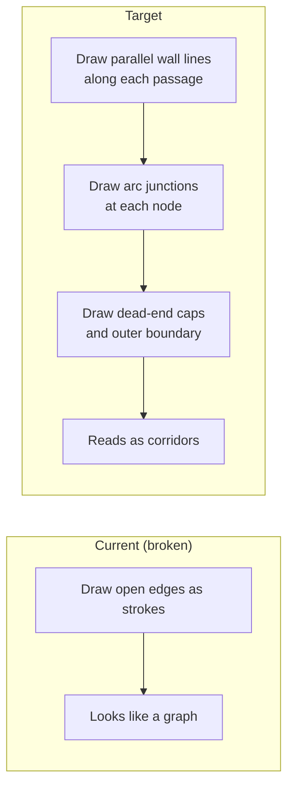

# Organic Corridor Rendering

## Problem

The current `drawOrganicMaze` draws open passages as stroked Bezier curves. The result looks like a node-and-edge graph diagram, not a maze. A maze needs **walls** — continuous boundaries that define navigable corridors.

## Approach: Offset-wall corridors with arc junctions

Draw the maze the same way the grid renderer does: **draw walls, not passages.** The white paper between wall lines becomes the corridor.

### Geometry per passage (open edge A to B)

- **Centerline:** straight line from A center to B center (short segments between touching circles look organic without Bezier curves)
- **Perpendicular:** rotate direction 90 degrees
- **Left wall:** offset centerline by `+corridorWidth/2` perpendicular
- **Right wall:** offset centerline by `-corridorWidth/2` perpendicular
- Draw both as thin black lines (`wallThickness`)

### Geometry per node (junction)

- Compute angle from node center to each **open** neighbor; sort by angle
- Between each adjacent pair of open passages: draw a **wall arc** (radius = `corridorWidth/2`, centered on node) connecting the right-wall endpoint of passage *i* to the left-wall endpoint of passage *i+1*
- **Dead end** (1 open passage): semicircular cap (180-degree arc) connecting the two wall endpoints on the non-corridor side
- **Leaf with 0 open passages:** skip (shouldn't exist in a spanning tree)

### Outer boundary

- Draw a rectangle at the maze area bounds (same position as the transform origin + maze dimensions). This closes off the outer edge the way grid cells' outer walls do.

### Parameters

- `corridorWidth`: `Math.max(lineThickness * 3, 8)` — slightly narrower than current to leave visible wall mass between adjacent corridors
- `wallThickness`: `lineThickness * scale` (unchanged)
- All drawing via `page.drawLine` (wall segments) and `page.drawSvgPath` with SVG arc commands (junction arcs, caps)

## Files changed

Only [src/pdf/renderer.js](src/pdf/renderer.js), function `drawOrganicMaze` (lines ~203-269). Replace the two-pass Bezier approach with the offset-wall approach. No changes to generation, graph, solver, or tests.

The solver overlay (`drawOrganicSolverOverlay`, line ~316) draws through node centers, which naturally align with corridor centers. No changes needed.

## Checkpoints

### C0 — Parallel wall lines for each passage

Replace the current `drawOrganicMaze` body with:

- For each open edge (A, B): compute perpendicular, draw left-wall and right-wall lines
- No junction treatment yet — walls will have gaps at nodes
- **Validation:** Generate a PDF; corridors should be visible as parallel wall lines with gaps at junctions

### C1 — Junction arcs and dead-end caps

At each node:

- Sort open passages by angle
- Draw wall arcs between adjacent passage walls (SVG arc command `A r r 0 largeArcFlag 1 endX endY`)
- Draw semicircular caps at dead ends
- **Validation:** Walls should now be continuous; maze reads as enclosed corridors

### C2 — Outer boundary and tuning

- Draw rectangular border around maze area
- Tune `corridorWidth` so corridors aren't too wide/narrow for different age presets
- Verify solver overlay still aligns with corridors
- Run full test suite (73 tests, no changes expected)
- **Validation:** Complete organic maze that looks like a maze, all tests pass

## Out of scope

- Changes to circle-packing, organic-graph, organic-generator, or solver
- Curved (Bezier) corridor walls (straight segments between touching circles already look organic; curves can be a future refinement)
- New tests (rendering is visual; existing PDF generation tests cover the code path)

