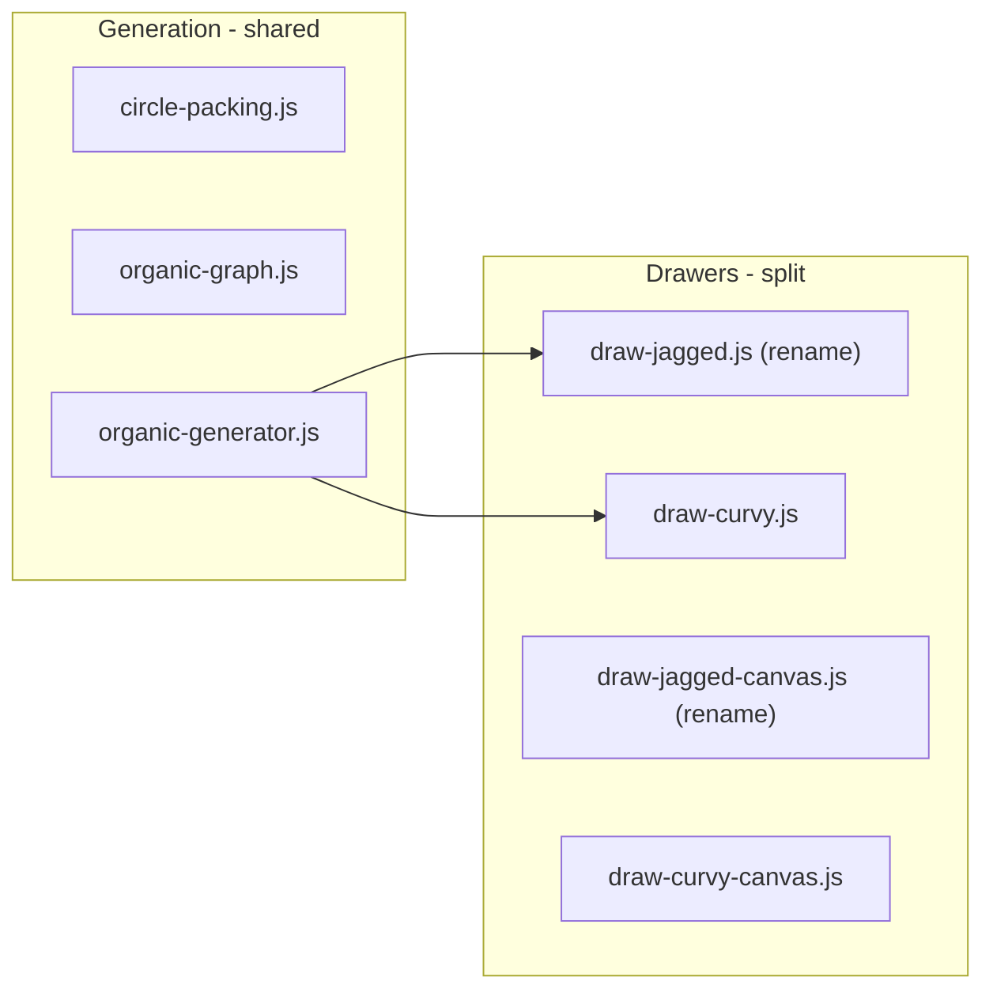

# Organic Enhancements: Jagged/Curvy Split, Dense Fill, 2.5D Bridges

**Status:** draft (deferred — not yet committed to v1)  
**Spec:** to be added to `DEFERRED_IDEAS.md`  
**Related:** D-008 (organic topology), D-004 (style naming)  
**Scope:** Organic maze sub-styles only. Grid styles (Classic, Square) and Polar topology are unaffected.

---

## Summary

Three enhancements to organic mazes, ordered by dependency:

1. **Dense fill** — algorithmic change to circle packing so corridors cover most of the rectangular boundary (less white space)
2. **Jagged / Curvy split** — rename current Organic to "Jagged"; add "Curvy" as a bezier-rendered variant
3. **2.5D visual bridges (Curvy only)** — allow corridors to visually cross over each other while the maze remains a perfect tree

---

## 1 — Dense Fill (White Space Reduction)

**Problem:** Current circle packing (`packCircles` in [src/maze/circle-packing.js](src/maze/circle-packing.js)) uses `area * 0.4` as the coverage target. Combined with variable radii and repulsion, this leaves visible gaps between corridors.

**Approach:**

- Increase coverage factor (e.g. `0.4` -> `0.55`-`0.65`) and/or reduce `minR` floor so more, smaller circles fill gaps
- Tighten attraction range in the repulsion/attraction loop so circles settle closer together
- Possibly add a **gap-fill pass** after the main packing: detect large void regions (Voronoi-style) and inject additional small circles, then re-run `ensureConnected` and `computeNeighbors`
- All changes must remain deterministic (same seed -> same layout)

**Key constraints:**

- Must not break connectivity guarantee (`ensureConnected`)
- Denser packing means more nodes -> solver performance should be monitored (BFS on ~2000+ nodes is fine but worth a sanity check on 18+ age range)
- Corridor width (`avgDist * 0.35`) will naturally shrink as circles pack tighter; may need a minimum corridor width floor

**Files affected:**

- [src/maze/circle-packing.js](src/maze/circle-packing.js) — packing constants, optional gap-fill pass
- [src/utils/constants.js](src/utils/constants.js) — may increase `organicNodeCount` per age range
- [src/pdf/drawers/draw-organic.js](src/pdf/drawers/draw-organic.js) and canvas variant — corridor width clamping

---

## 2 — Jagged / Curvy Split

**Renaming:**

- Current internal value `'organic'` becomes `'jagged'`
- New value `'curvy'` added
- UI changes from 3 to 4 top-level style options: **Classic | Jagged | Curvy | Square Corners**

### Jagged (formerly Organic)

Identical pipeline to today: circle packing -> graph -> DFS -> straight-line corridor walls and junction arcs. No behavior change beyond the rename.

### Curvy

Same generation pipeline as Jagged (circle packing, graph, DFS). The difference is **rendering only**:

- Corridor walls: replace straight parallel lines with **cubic Bezier curves** between junction arcs
  - Control points offset perpendicular to the edge direction by a deterministic amount (e.g. function of edge angle, length, and node radius)
  - Both wall lines of a corridor curve in tandem so the corridor has consistent width
- Junction arcs: remain circular (or could become smooth spline connections — TBD during implementation)
- pdf-lib: use `drawSvgPath` with `C` (cubic Bezier) commands — already proven in the solution overlay renderer

**Architecture changes:**

**Drawer registry** ([src/pdf/drawers/index.js](src/pdf/drawers/index.js)):

- Add `jagged` and `curvy` layout types (or keep a single `organic` layout type and pass style to the drawer — TBD, but splitting drawers is cleaner)

**Dispatch in main.js:**

- Both `jagged` and `curvy` call `generateOrganicMaze()` (same generator)
- Layout type remains `'organic'` (or introduce `'jagged'`/`'curvy'` — implementation detail)
- Drawer selection branches on style

**Files affected:**

- [src/index.html](src/index.html) — add 4th style option, update labels
- [src/main.js](src/main.js) — dispatch both jagged/curvy to `generateOrganicMaze`, pass style to drawer
- [src/pdf/drawers/draw-organic.js](src/pdf/drawers/draw-organic.js) — rename to `draw-jagged.js`
- [src/pdf/drawers/draw-organic-canvas.js](src/pdf/drawers/draw-organic-canvas.js) — rename to `draw-jagged-canvas.js`
- New: `src/pdf/drawers/draw-curvy.js`, `src/pdf/drawers/draw-curvy-canvas.js`
- [src/pdf/drawers/index.js](src/pdf/drawers/index.js) — register new drawers
- [src/pdf/layout.js](src/pdf/layout.js) — handle style -> layout mapping
- [src/maze/solver-adapters.js](src/maze/solver-adapters.js) — no change (adapter works on graph, agnostic to rendering)
- [docs/DECISIONS.md](docs/DECISIONS.md) — new decision for Jagged/Curvy split

---

## 3 — 2.5D Visual Bridges (Curvy Only)

**Concept:** Some corridors visually cross over other corridors. The maze is still a **perfect tree** (single solution, no loops). The crossing is a rendering trick — the "over" corridor has a visual gap/shadow where it passes above the "under" corridor.

**Generation approach (two options to evaluate):**

- **Option A — Long-range edges:** After circle packing and neighbor detection, add a small number of non-adjacent "bridge edges" to the graph (connecting circles that are nearby but separated by intermediate circles). DFS may or may not include these edges. If included, the corridor must visually cross intermediate corridors. Selection is seeded/deterministic.
- **Option B — Post-carve bridge insertion:** After DFS carves the tree, identify pairs of tree edges whose straight-line renderings cross in 2D. Pick a subset of these crossings and designate one corridor as "over" (bridge). This avoids changing the graph construction — only the renderer needs to know about bridges.

Option B is simpler (generation is unchanged; only rendering and a post-processing pass are added) but may produce fewer crossings. Option A produces more interesting mazes but modifies the graph structure. **Recommendation: start with Option B**, since it keeps generation untouched and the maze-is-a-tree invariant is automatically satisfied.

**Rendering:**

- The "under" corridor is drawn normally
- The "over" corridor is drawn with a small gap (white rectangle or arc) where it crosses the "under" corridor, creating the visual illusion of a bridge/overpass
- Optional: thin parallel lines at the crossing edges ("bridge rails") for visual clarity
- Must be deterministic: same seed -> same bridge placements and rendering

**Solver:** No change. The solver operates on the tree graph. Bridges are purely visual — the solver doesn't know or care about them.

**Perfect maze invariant:** Preserved. The graph is still a tree. No new connections are added at crossing points. A corridor going "over" another does not create a path between them.

**Files affected:**

- New: `src/maze/bridge-detection.js` (post-carve analysis of corridor crossings)
- `src/pdf/drawers/draw-curvy.js` / canvas variant — bridge rendering logic
- Maze object gains optional `bridges` array: `[{ overEdge, underEdge, crossPoint }]`

---

## Scope Boundaries

**In scope:**

- Denser circle packing (algorithmic tuning + optional gap-fill)
- Jagged/Curvy UI split (4 top-level styles)
- Curvy bezier rendering
- 2.5D visual bridges for Curvy

**Out of scope:**

- Changing Classic, Square, or Polar styles
- Multi-layer solver (bridges are visual only)
- Relaxing perfect-maze invariant
- Animations
- Any persistence or network behavior

---

## Checkpoints

- **C0** — Dense fill: tune packing constants, optional gap-fill pass. Validate: visual comparison shows significantly less white space; existing tests pass; determinism maintained.
- **C1** — Rename: Organic -> Jagged in code and UI. Validate: all existing behavior preserved under new name; tests updated.
- **C2** — Curvy drawer: bezier corridor walls for `style === 'curvy'`. Validate: PDF + canvas render correctly; maze still solvable; deterministic.
- **C3** — UI: 4-option style selector (Classic, Jagged, Curvy, Square Corners). Validate: each style generates + renders correctly.
- **C4** — 2.5D bridges: bridge detection + visual rendering for Curvy. Validate: bridges render with visible crossings; solver unaffected; maze remains perfect.

---

## Validation

- Existing tests pass with renamed styles
- New unit tests for bezier corridor geometry and bridge detection
- Determinism: same seed + style -> identical PDF output
- Solver: every generated maze (Jagged + Curvy, with and without bridges) validated as solvable with single solution
- Visual inspection of dense fill, curvy rendering, and bridge crossings

---

## Open Questions (to resolve during implementation)

1. **Gap-fill strategy:** simple constant tuning vs. a Voronoi-based gap-fill pass — depends on how much white space remains after tuning
2. **Curvy control point formula:** perpendicular offset magnitude, how to keep corridor width consistent along curves
3. **Bridge frequency:** how many crossings per maze (too many = confusing; too few = pointless) — likely a constant or age-scaled parameter
4. **Drawer dispatch:** single `organic` layout type with style branching, or separate `jagged`/`curvy` layout types — implementation-time decision

