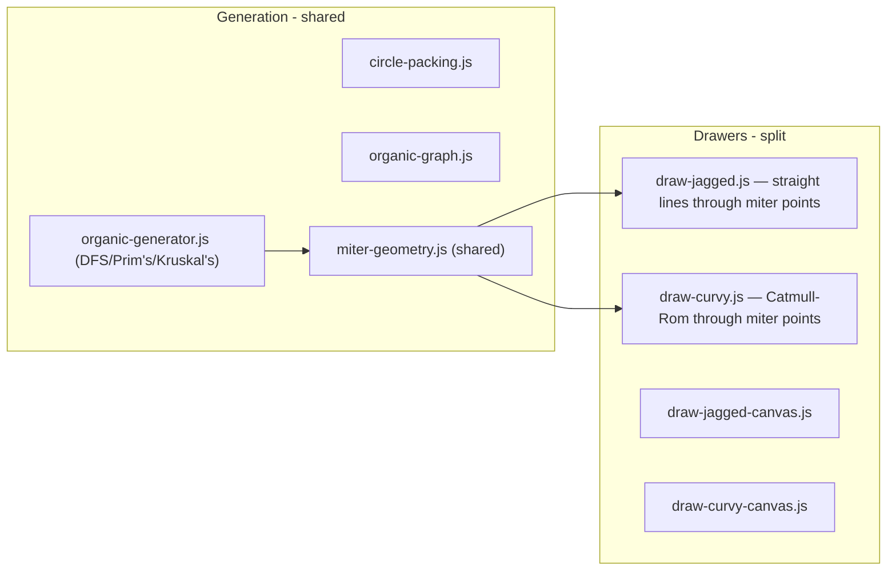
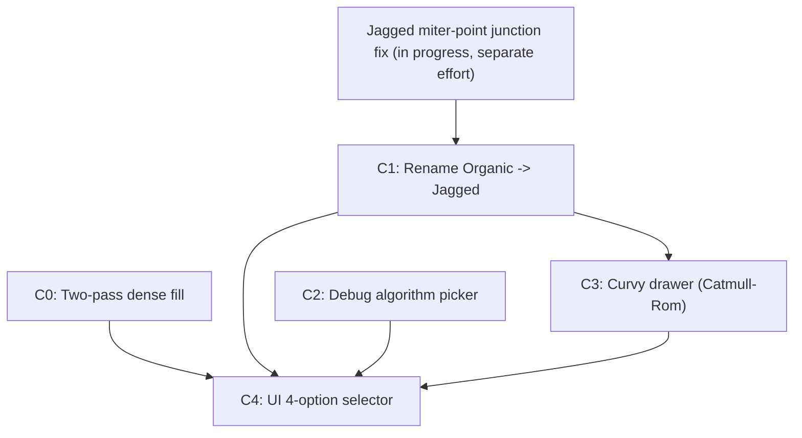

# Organic Enhancements: Jagged/Curvy Split, Dense Fill, Catmull-Rom Curves

**Status:** draft (deferred — not yet committed to v1)  
**Spec:** to be added to `DEFERRED_IDEAS.md`  
**Related:** D-008 (organic topology), D-004 (style naming)  
**Scope:** Organic maze sub-styles only. Grid styles (Classic, Square) and Polar topology are unaffected.  
**2.5D bridges:** Deferred to a separate future effort (see DEFERRED_IDEAS.md). Not part of this plan's checkpoints.

---

## Summary

Four changes to organic mazes, ordered by dependency:

1. **Two-pass dense fill** — pass 1 generates the maze at current density (difficulty control); pass 2 adds decorative disconnected corridors in void regions (visual complexity)
2. **Jagged / Curvy split** — rename current Organic to "Jagged"; add "Curvy" as a Catmull-Rom-rendered variant that reuses jagged's miter-point geometry
3. **Debug algorithm picker** — "1 of each algorithm" mode; all 3 existing algorithms available for jagged/curvy
4. **UI update** — 4 top-level style options: Classic, Jagged, Curvy, Square Corners

---

## 1 — Two-Pass Dense Fill

### Problem

Current circle packing (`packCircles` in [src/maze/circle-packing.js](src/maze/circle-packing.js)) uses `area * 0.4` as the coverage target. Combined with variable radii and repulsion, this leaves visible white space between corridors.

### Approach: Two passes with separated concerns

**Pass 1 — Maze generation (unchanged difficulty):**
Standard pipeline: `packCircles` at current density -> `buildOrganicGraph` -> DFS/Prim's/Kruskal's carving -> solver validation. The `organicNodeCount` per age range stays as-is. Difficulty is controlled entirely by this pass.

**Pass 2 — Decorative fill (visual complexity only):**
After the maze is carved and validated:
- Detect void regions in the packing (areas where no circle exists)
- Insert filler circles into voids (smaller radii, deterministic placement from same seeded RNG)
- Build a separate disconnected graph for filler circles (neighbors among themselves only — **no edges to pass-1 maze nodes**)
- Carve short corridors within the filler graph (random short DFS walks or similar) to create decorative paths
- These decorative corridors look like real passages but are completely disconnected from the solvable maze — they lead nowhere and increase visual difficulty for the person solving

**Key properties:**
- Maze remains a perfect tree (filler is disconnected — solver never sees it)
- Difficulty is controlled by pass 1 node count; visual density is controlled by pass 2
- Deterministic: same seed -> same filler placement and decorative carving
- Filler corridors are rendered identically to maze corridors (same wall style, same thickness) — indistinguishable to the solver

### Key constraints

- Filler circles must not overlap with pass-1 circles
- Filler connectivity is self-contained — `computeNeighbors` for filler runs on filler circles only
- Corridor width floor: as circles pack tighter overall, ensure corridors remain printable (minimum width proportional to `lineThickness`)
- Performance: pass-2 geometry is render-only, not solver-verified. Keep filler node count bounded.

### Files affected

- [src/maze/circle-packing.js](src/maze/circle-packing.js) — new `fillVoids(existingCircles, bounds, seed)` function
- [src/maze/organic-generator.js](src/maze/organic-generator.js) — call pass 2 after carving; attach filler graph to maze object
- [src/pdf/drawers/draw-organic.js](src/pdf/drawers/draw-organic.js) and canvas variant — render filler corridors alongside maze corridors
- Maze object gains optional `fillerGraph` (pass-2 disconnected graph with its own carved edges)

---

## 2 — Jagged / Curvy Split

### Renaming

- Current internal value `'organic'` becomes `'jagged'`
- New value `'curvy'` added
- UI: 4 top-level style options: **Classic | Jagged | Curvy | Square Corners**

### Jagged (formerly Organic)

Same pipeline: circle packing -> graph -> algorithm carving -> miter-point junction geometry -> straight-line corridor walls.

**Prerequisite dependency:** The in-progress miter-point work on organic junction rendering (fixing inner-angle wall intersections) must land first. Jagged inherits that fix directly.

### Curvy

Same generation pipeline as Jagged (same circle packing, same graph, same algorithm). The difference is **rendering only**:

**Curve type: Catmull-Rom splines** (not Bezier). Catmull-Rom passes *through* defined points rather than toward control points, producing more natural flowing curves. Converted to cubic Bezier segments for SVG path output (`drawSvgPath` with `C` commands in pdf-lib).

**Shared geometry with Jagged — miter points as guide points:**
- Jagged's miter-point computation (distance from circle center, angle-dependent positioning) produces the guide points that both styles use
- Jagged draws straight wall segments between these miter points
- Curvy runs a Catmull-Rom spline through the same miter points, producing flowing curves
- The distance/angle logic is shared; only the final rendering step differs

**Guide point positioning (initial target — to be tuned):**
- Inner angles (tight junctions, acute angle between adjacent corridors): guide point ~1.5-2R from circle center. No junction arc — the spline handles continuity by swinging wide.
- Outer angles (wide junctions, obtuse angle): guide point ~1-1.5R from circle center. Less swing needed.
- These distances may be reused directly from jagged's miter-point work if that geometry proves correct.

**Rendering strategy — incremental:**
1. Start with **per-edge Catmull-Rom** — each corridor edge gets its own spline segment through its guide points, joined with smooth tangent-matching transitions at nodes
2. If visual quality warrants it, upgrade to **continuous outline** — trace the full wall boundary as one flowing spline path per connected wall contour (bigger renderer rewrite, more flowing result)

**Junction handling:**
- Per-edge mode: junctions are implicit — tangent continuity between adjacent edge splines at shared miter points provides smooth transitions
- Continuous-outline mode: no separate junction logic needed — the outline path flows continuously

### Architecture

### Dispatch

- Both `jagged` and `curvy` call `generateOrganicMaze()` (same generator, same algorithm selection)
- Layout type remains `'organic'` on the maze object; drawer registry uses style (`jagged`/`curvy`) to select the correct drawer
- Solver adapter is unchanged — operates on the graph, agnostic to rendering

### Files affected

- [src/index.html](src/index.html) — 4th style option
- [src/main.js](src/main.js) — dispatch both jagged/curvy to `generateOrganicMaze`, pass style to drawer
- [src/pdf/drawers/draw-organic.js](src/pdf/drawers/draw-organic.js) — rename to `draw-jagged.js`
- [src/pdf/drawers/draw-organic-canvas.js](src/pdf/drawers/draw-organic-canvas.js) — rename to `draw-jagged-canvas.js`
- New: `src/pdf/drawers/draw-curvy.js`, `src/pdf/drawers/draw-curvy-canvas.js`
- New or extracted: `src/pdf/drawers/miter-geometry.js` — shared miter-point computation
- [src/pdf/drawers/index.js](src/pdf/drawers/index.js) — register jagged + curvy drawers
- [src/pdf/layout.js](src/pdf/layout.js) — style -> layout mapping
- [src/maze/solver-adapters.js](src/maze/solver-adapters.js) — no change
- [docs/DECISIONS.md](docs/DECISIONS.md) — new decision for Jagged/Curvy split and Catmull-Rom choice

---

## 3 — Debug Algorithm Picker

### Current state

- Organic mazes are hardcoded to DFS in [src/maze/organic-generator.js](src/maze/organic-generator.js)
- Grid mazes already support Prim's, DFS (Recursive Backtracker), and Kruskal's
- Debug mode has a "1 of each" option that generates one maze per age level

### Changes

**Make all 3 algorithms available for jagged/curvy:**
- `generateOrganicMaze` accepts an `algorithm` parameter (default: age-mapped, same as grid)
- DFS, Prim's, and Kruskal's all operate on the organic graph (they only need `getNeighbors`, `removeWall` — already available on `OrganicGraph`)

**New debug generation mode — "1 of each algorithm":**
- User selects an age level
- Generates 3 mazes at that level: one with DFS, one with Prim's, one with Kruskal's
- Uses the currently selected style (jagged or curvy; also works with classic/square for grid)
- PDF labels each page with the algorithm used

**Relabel existing debug option:**
- Current "1 of each" becomes **"1 of each level"** (user selects the style, generates one maze per age level)

### Files affected

- [src/maze/organic-generator.js](src/maze/organic-generator.js) — accept `algorithm` param, dispatch to DFS/Prim's/Kruskal's on organic graph
- [src/main.js](src/main.js) — debug mode UI and generation logic for new mode
- [src/index.html](src/index.html) — debug panel controls for mode selection

---

## 4 — 2.5D Visual Bridges (DEFERRED)

Moved to `DEFERRED_IDEAS.md`. Summary for reference:

- Corridors visually cross over other corridors while maze remains a perfect tree
- Two generation approaches considered: (A) long-range non-planar edges in the graph, (B) post-carve visual crossing detection. Option A is likely required since tree edges of a planar graph don't cross.
- Visual rendering: "over" corridor drawn with gap/shadow at crossing point, optional bridge rails
- Solver unaffected; perfect maze invariant preserved
- **Implementation timing:** depends on maturity of Curvy style and miter-point geometry. To be scheduled after Curvy is stable.

---

## Scope Boundaries

**In scope:**

- Two-pass dense fill (decorative disconnected corridors)
- Jagged/Curvy UI split (4 top-level styles)
- Catmull-Rom curve rendering for Curvy (reusing jagged miter-point geometry)
- All 3 algorithms available for organic-topology styles
- Debug mode: "1 of each algorithm" + relabeled "1 of each level"

**Out of scope:**

- Changing Classic, Square, or Polar styles
- 2.5D bridges (deferred separately)
- Relaxing perfect-maze invariant
- Animations
- Any persistence or network behavior

---

## Checkpoints

- **C0** — Two-pass dense fill: pass-1 unchanged, pass-2 decorative corridors in void regions. Validate: visual comparison shows significantly less white space; filler corridors are disconnected (solver ignores them); existing tests pass; determinism maintained.
- **C1** — Rename: Organic -> Jagged in code and UI. Validate: all existing behavior preserved under new name; tests updated. *Prerequisite: jagged miter-point junction work must be complete.*
- **C2** — Debug algorithm picker: all 3 algorithms for organic graph; "1 of each algorithm" mode; relabel existing "1 of each" to "1 of each level". Validate: each algorithm produces valid perfect mazes on organic graph; debug PDF labels correct.
- **C3** — Curvy drawer: Catmull-Rom through shared miter points, per-edge first. Validate: PDF + canvas render correctly; maze still solvable; deterministic; visually distinct from jagged. If per-edge quality is insufficient, explore continuous-outline upgrade.
- **C4** — UI: 4-option style selector (Classic, Jagged, Curvy, Square Corners). Validate: each style generates + renders correctly; dispatch and drawer registry wired.

---

## Validation

- Existing tests pass with renamed styles
- New unit tests for: Catmull-Rom segment generation, miter-point geometry, void detection and filler placement, algorithm dispatch on organic graph
- Determinism: same seed + style + algorithm -> identical PDF output
- Solver: every generated maze (Jagged + Curvy, all algorithms) validated as solvable with single solution
- Filler corridors: verified disconnected from maze graph (not reachable from start/finish)
- Visual inspection: dense fill coverage, curvy rendering quality, algorithm character differences

---

## Dependencies and Ordering

C0 (dense fill) and C2 (debug algo picker) can proceed in parallel. C1 (rename) depends on the miter-point work landing. C3 (curvy) depends on C1 (shared miter geometry). C4 (UI) is the final integration checkpoint.

---

## Open Questions (to resolve during implementation)

1. **Void detection strategy for pass 2:** grid-based sampling vs. Voronoi gaps vs. spatial-hash scan for empty cells — TBD based on performance and coverage quality
2. **Filler corridor length/branching:** how much decorative carving in pass-2 filler — short dead-end stubs vs. small branching trees? Tuning parameter per age range (more filler complexity for older ages)
3. **Catmull-Rom tension parameter:** Catmull-Rom has a tension parameter (0 = Catmull-Rom, 1 = straight lines); tuning this affects how flowing vs. tight the curves are
4. **Drawer dispatch detail:** single `organic` layout type with style branching in drawer registry, or separate `jagged`/`curvy` layout types — implementation-time decision
5. **Algorithm character for organic:** DFS produces long corridors, Prim's produces bushy dead-ends, Kruskal's is uniform. Should the age-mapped algorithm defaults for organic differ from grid, or reuse the same mapping?

