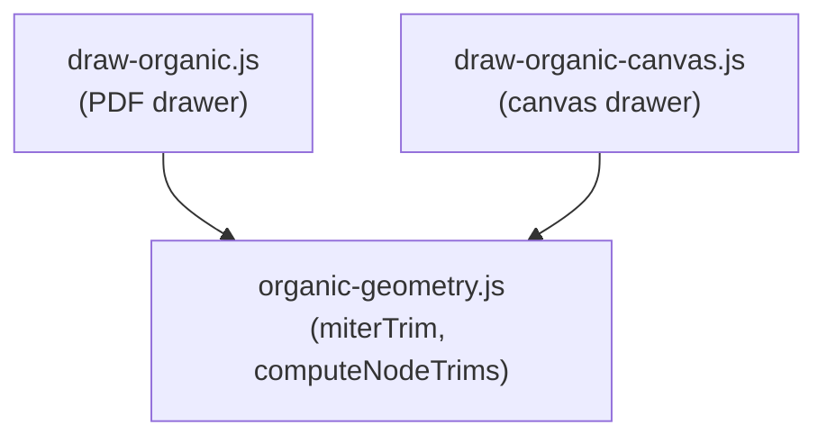

# Organic Junction Miter Joints

**Status:** draft
**Last updated:** 2026-02-17
**Related:** D-008 (organic topology)

---

## Overview

At organic maze junctions, corridor walls currently trim to a uniform `geometricTrim` distance derived from a fixed junction circle radius (`junctionR`). This one-size-fits-all approach causes visual overlap at acute-angle junctions and imprecise connections at other angles.

The fix: derive the trim distance directly from the gap angle between adjacent corridors using a closed-form trigonometric formula. No line-line intersection needed. The junction circle concept (`junctionR`, `geometricTrim`, `halfOpenAngle`) is eliminated entirely and replaced by per-wall miter geometry.

---

## Scope

**In scope:**

- New shared module with miter trim formula and per-node trim computation
- Per-wall trim distances in corridor drawing (both PDF and canvas drawers)
- Junction wall sections: skip for acute gaps, variable-radius arcs for wide gaps
- Remove `junctionR`, `geometricTrim`, and `halfOpenAngle` constants
- Revert experimental `junctionR` bump and `lineCap` change on this branch
- Visual validation at multiple age ranges

**Out of scope:**

- Circle packing changes (dense fill is a separate effort)
- Grid/Classic/Square styles (unaffected)
- Solver or generation changes (rendering only)

---

## Architecture

The geometry logic is extracted into a shared module. Both drawers import it instead of duplicating the math.




**Files touched:**

- **New:** [src/pdf/drawers/organic-geometry.js](src/pdf/drawers/organic-geometry.js) -- shared geometry
- **Modified:** [src/pdf/drawers/draw-organic.js](src/pdf/drawers/draw-organic.js) -- PDF drawer
- **Modified:** [src/pdf/drawers/draw-organic-canvas.js](src/pdf/drawers/draw-organic-canvas.js) -- canvas drawer

**Key interfaces / contracts:**

The shared module exports:

- `miterTrim(gapAngle, halfW)` -- returns `halfW / tan(gapAngle / 2)`: the trim distance along the corridor direction for a wall bordering a gap of angle `gapAngle`
- `miterRadius(gapAngle, halfW)` -- returns `halfW / sin(gapAngle / 2)`: the radial distance from the node center to the miter point (for arc drawing)
- `computeNodeTrims(passages, halfW)` -- returns `Map<nid, { leftTrim, rightTrim }>` with per-wall trim distances for every passage at a node, derived from the gap angles on each side

---

## Geometry Detail

### The miter formula

At a node, two adjacent passages separated by gap angle `alpha` have their facing walls meet at a single miter point. The right triangle formed by `(halfW, trimDist, miterRadius)` with half-angle `alpha/2` gives:

```
trimDist   = halfW / tan(alpha / 2)     (along corridor direction)
miterRadius = halfW / sin(alpha / 2)     (from node center)
```

The miter point lies on the gap's angular bisector at `miterRadius` from the node center. Both facing walls converge to exactly this point.

### Reference values


| Gap angle | trimDist      | miterRadius  | Behavior                   |
| --------- | ------------- | ------------ | -------------------------- |
| 30 deg    | 3.73 * halfW  | 3.86 * halfW | Far; needs dist*0.45 cap   |
| 60 deg    | 1.73 * halfW  | 2.0 * halfW  | Moderate                   |
| 90 deg    | 1.0 * halfW   | 1.41 * halfW | Clean 45-degree miter      |
| 120 deg   | 0.577 * halfW | 1.15 * halfW | Compact                    |
| 150 deg   | 0.268 * halfW | 1.04 * halfW | Close to old geometricTrim |
| 180 deg   | 0             | 1.0 * halfW  | Straight-through corridor  |


Compare to the old fixed `geometricTrim` of ~0.32 * halfW (at `junctionR = 1.05`), which was correct only for ~145-degree gaps.

### Per-wall asymmetry

Each corridor has two walls, each bordering a different gap:

- **Left wall** (CCW side): borders the gap between this passage and the next passage (CCW)
- **Right wall** (CW side): borders the gap between the previous passage and this one

Each wall gets its own trim distance from its respective gap angle:

```
passage[i].leftTrim  = miterTrim(gap between i and i+1, halfW)
passage[i].rightTrim = miterTrim(gap between i-1 and i, halfW)
```

Both are capped by `dist * 0.45` (where dist is the edge length to the neighbor) to prevent corridor segments from having negative length.

### What replaces the junction arcs

The old code drew arcs on a fixed junction circle (`junctionR`) between corridor wall endpoints. With miter joints:

- **Acute gaps (< ~90 deg):** walls meet at the miter point. No arc needed -- the junction is sealed by the corridor walls themselves.
- **Wide gaps (>= ~90 deg):** the miter point is close to the node center. Draw an arc of radius `miterRadius(alpha)` centered at the node, sweeping from one miter point to the other. Each gap has its own radius, so adjacent arcs may have different radii -- this is correct and produces a natural-looking polygonal/curved junction.
- **Dead ends (single passage):** the entire 360-minus-opening is one wide gap. Draw a full arc (minus the corridor opening) at `miterRadius` for that gap, or fall back to a reasonable default radius (e.g. `halfW * 1.05`).

### Dead code fix

In the current arc loop, the `span < 0` branch (lines 130-143 in PDF, 115-127 in canvas) is unreachable because the `span < 0.02` continue on the line above catches all negative spans. This should be reordered or removed.

---

## Checkpoints

- **C0 -- Shared geometry module + reverts**
  - Create `organic-geometry.js` with `miterTrim`, `miterRadius`, and `computeNodeTrims`
  - Revert `junctionR` from `1.2`/`1.25` back to `1.05` in both drawers
  - Revert `lineCap` from `2` back to `1` in `draw-organic.js` line 104
  - No functional change yet -- both drawers still use the old uniform trim
  - Validate: `npm test` passes, preview renders as before (with original junction circles)
- **C1 -- Per-wall miter trims in corridor drawing**
  - Import `computeNodeTrims` in both drawers
  - Pre-compute `nodeTrims` map (node.id -> Map<nid, {leftTrim, rightTrim}>) before the corridor loop
  - Replace uniform `trimA`/`trimB` with per-wall values from nodeTrims
  - Left wall of a corridor uses `leftTrim` at each end; right wall uses `rightTrim`
  - `dist * 0.45` safety cap still applies per-wall
  - Remove `junctionR`, `geometricTrim`, and `halfOpenAngle` constants (no longer needed for corridor trimming)
  - Validate: visual inspection at ages 3, 6-8, 18+ -- corridor walls should terminate cleanly
- **C2 -- Junction wall sections (arcs and miter closures)**
  - Replace the fixed-radius arc loop with miter-aware logic:
    - Compute gap angle for each pair of adjacent passages
    - If acute (< 90 deg): skip -- walls already meet at miter point
    - If wide (>= 90 deg): draw arc at radius `miterRadius(alpha)` connecting the two miter endpoints
  - Handle dead-end nodes (single passage): arc covers the full non-opening wall
  - Fix or remove the dead `span < 0` branch
  - Validate: visual inspection -- clean junctions at all angles, no gaps or overlap
- **C3 -- Tests and final validation**
  - Unit tests for `miterTrim` and `miterRadius` (known angles: 60, 90, 120, 180 deg)
  - Unit tests for `computeNodeTrims` (single passage, two passages at 45 deg, three+ passages)
  - Existing tests pass (`npm test`)
  - Determinism: same seed produces same maze structure (pixel output differs due to the rendering improvement)
  - Visual spot-check across all age ranges in both canvas preview and PDF output

---

## Validation

**Tests to add/update:**

- Unit tests for `miterTrim(alpha, halfW)` at known angles
- Unit tests for `miterRadius(alpha, halfW)` at known angles
- Unit tests for `computeNodeTrims` (edge cases: single passage, two passages, virtual start/finish passages)
- Existing `tests/pdf.test.js` organic rendering test should still pass

**Commands to run:**

```bash
npm test
npm run dev   # visual inspection in browser
```

**Pass criteria:**

- All existing tests pass
- No visible wall overlap at organic maze junctions (visual)
- Clean wall connections at all gap angles (visual)
- Same seed + parameters produces same maze structure (determinism preserved)

---

## Notes / Risks

- **Narrow gaps with short edges:** `miterTrim` grows large for small gap angles (e.g. 30-deg gap -> 3.73 * halfW). The `dist * 0.45` cap prevents corridors from having negative length, but very narrow gaps on short edges will produce stubby corridors. This is the geometrically correct behavior.
- **Boundary corridors:** Start/finish virtual passages (nid -1, -2) participate in gap angle computation normally. Their gap to adjacent real passages determines the miter trim on that side. The boundary-facing wall (toward the maze edge) uses a default trim since there is no adjacent passage on that side.
- **Dead-end nodes (single passage):** Only one gap (the full ~~360 deg minus the corridor opening). `miterTrim` for this gap will be very small (~~0), correctly placing the wall endpoints at approximately `halfW` perpendicular offset. The arc covers the full non-opening wall area.
- **Variable-radius arcs:** Each gap gets its own arc radius. Adjacent arcs may not share a tangent, producing a slight kink at the transition. This is acceptable -- the visual effect is a natural-looking junction shape rather than a perfect circle.
- **Performance:** One `tan()` and one `sin()` call per gap per node. Negligible even at 1900 nodes.

---

**Next review:** after C1 (visual validation confirms miter trims produce clean corridor endpoints)