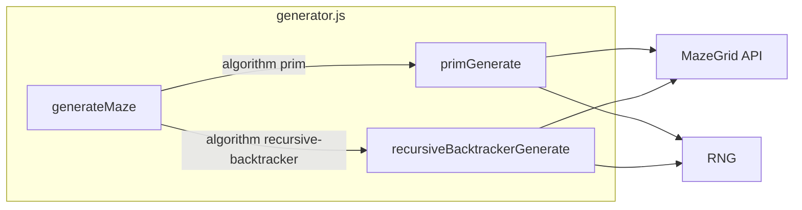

# Recursive Backtracker / DFS Implementation Plan

**Status:** draft  
**Scope:** Implement the algorithm and wire it into the generator; no UI or age-based selection in this plan.

---

## Context

- **Current:** [src/maze/generator.js](src/maze/generator.js) uses Prim's only. [DECISIONS.md](docs/DECISIONS.md) D-001 chose Prim's for v0; [DEFERRED_IDEAS.md](docs/DEFERRED_IDEAS.md) lists "Age-Specific Algorithm Selection" (Prim 3–8, Recursive Backtracker 9+) as deferred.
- **Goal:** Implement Recursive Backtracker so it can be used (e.g. later for age-based selection or as an option). Same constraints: deterministic (seeded RNG), perfect mazes only, existing grid/solver unchanged.

**Recursive Backtracker (DFS) outline:**

1. Start at a cell (random via RNG for variety; same seed → same start).
2. Mark current cell visited; get unvisited neighbors; shuffle order with RNG; for each, remove wall, recurse (or push and loop).
3. When no unvisited neighbors, backtrack. Repeat until all cells visited.

**Why iterative (stack) over recursion:** Large presets (e.g. 24×30) can blow the call stack; an explicit stack avoids that and keeps behavior identical.

---

## Scope

**In scope:**

- Implement `recursiveBacktrackerGenerate(grid, rng)` in [src/maze/generator.js](src/maze/generator.js) using existing [MazeGrid](src/maze/grid.js) API: `getUnvisitedNeighbors`, `removeWallBetween`, `markVisited`. Use [rng.shuffle](src/utils/rng.js) for deterministic neighbor order.
- Add `algorithm` to generator config: `'prim' | 'recursive-backtracker'`, default `'prim'`. Branch in `generateMaze` and pass through in `generateMazes`.
- Unit tests: determinism (same seed + algorithm → same grid), validity (RB mazes pass [validateMaze](src/maze/solver.js)), and that default remains Prim.
- Brief doc update: DECISIONS.md (extend D-001 or add note that RB is available).

**Out of scope:**

- UI for algorithm choice.
- Age-based algorithm selection (Prim 3–8, RB 9+); can be a follow-up.
- Changes to grid, solver, or PDF pipeline.

---

## Architecture




**Files touched:**

- [src/maze/generator.js](src/maze/generator.js) — add RB implementation and algorithm branch.
- [tests/maze.test.js](tests/maze.test.js) — tests for RB determinism and validity.
- [docs/DECISIONS.md](docs/DECISIONS.md) — note RB availability.
- Optionally [src/maze/solver.js](src/maze/solver.js) — comment only: "generated by Prim's or Recursive Backtracker".

**Key contracts:**

- `generateMaze({ ageRange, seed?, algorithm? })` — `algorithm` defaults to `'prim'`.
- `generateMazes({ ageRange, quantity, baseSeed?, algorithm? })` — passes `algorithm` to each `generateMaze`.
- Same `(ageRange, seed, algorithm)` → same maze (determinism).

---

## Implementation Details

**Recursive Backtracker (iterative):**

- Stack of `{ row, col }`. Start cell = `(rng.randomInt(0, rows-1), rng.randomInt(0, cols-1))`; mark visited.
- Loop: current = stack top; neighbors = `grid.getUnvisitedNeighbors(current.row, current.col)`; if empty, pop and continue; else `rng.shuffle(neighbors)`, pick first, `grid.removeWallBetween(current, neighbor)`, neighbor.markVisited(), push neighbor, continue.
- Loop until stack is empty. All cells are visited because the grid is connected by construction.

**Config handling:**

- In `generateMaze`: `const algorithm = config.algorithm ?? 'prim'`. After building grid and creating RNG, call `algorithm === 'recursive-backtracker' ? recursiveBacktrackerGenerate(grid, rng) : primGenerate(grid, rng)`.
- In `generateMazes`: `const algorithm = config.algorithm ?? 'prim'` and pass `algorithm` into each `generateMaze` call.

---

## Checkpoints

- **C0** — Implement `recursiveBacktrackerGenerate(grid, rng)` in generator.js; call it from `generateMaze` when `config.algorithm === 'recursive-backtracker'`. Default remains `'prim'`. Run `npm run build` and existing maze tests (all Prim, unchanged).
- **C1** — Add unit tests: (1) RB with fixed seed produces valid maze (validateMaze), (2) same seed + RB produces identical maze (wall comparison), (3) default algorithm is Prim (no new param → same as today). Run `npm run test`.
- **C2** — Update DECISIONS.md (and optionally solver comment). Run full test suite and e2e if available.

---

## Validation

**Tests to add/update:**

- In `tests/maze.test.js`: new describe block or cases for algorithm `'recursive-backtracker'`: determinism (same seed → same walls), validity (validateMaze true), and one test that default is Prim (e.g. generate without algorithm, compare to explicit `algorithm: 'prim'` or rely on existing tests as regression).

**Commands:**

```bash
npm run build
npm run test
```

Optional: `npx playwright test` for e2e (no algorithm UI change, so existing e2e should still pass).

**Pass criteria:**

- Build succeeds; all existing tests pass.
- New tests for Recursive Backtracker pass; determinism and validateMaze hold.

---

## Notes / Risks

- **Stack overflow:** Use iterative DFS (explicit stack), not recursion, for large grids.
- **Determinism:** Start cell and neighbor order must be driven only by the seeded RNG (already guaranteed by `rng.shuffle` and `rng.randomInt`).
- **Perfect maze:** RB produces a spanning tree, so single solution is guaranteed; existing solver and validateMaze apply as-is.

