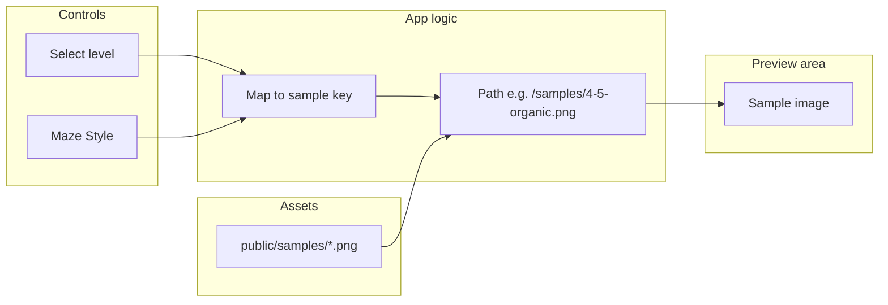

# Sample / Pregenerated Output on Right Panel

**Status:** draft  
**Scope:** Display a static sample image in the right preview area based on selected **level** and **maze style**. Samples are app-provided assets (not live-generated); they will not match the generated PDF. **The preview does not display any solver or solution path.**

---

## Context

- Current UI: controls left (~30–35%), [preview area](src/index.html) right with intentional whitespace and a faint maze background ([main.css](src/styles/main.css) `.preview-area`, `.maze-background`). Level selector uses vertical [level-select](src/index.html) (label + age per option).
- Controls that drive sample selection (from [index.html](src/index.html) and [constants.js](src/utils/constants.js)):
  - **Select level** (`name="age-range"`): values `3`, `4-5`, `6-8`, `9-11`, `12-14`, `15-17`, `18+` (7 levels: Intro → Epic Adventure).
  - **Maze Style** (`name="maze-style"`): `rounded` (Grid), `organic` (Organic), `square` (Square Corners).
- Theme remains hidden. v0 spec: no *user* persistence; sample images are **app assets** (like `public/themes/`), so static files are in scope.

---

## Storage: Static files (recommended)

Use **static image files** in the repo, not a runtime database:

- **Location:** `public/samples/` so Vite serves them at `/samples/...` (offline-safe, no fetch to network).
- **Naming:** One image per (age-range value, maze-style value). Age values: `3`, `4-5`, `6-8`, `9-11`, `12-14`, `15-17`, `18+`. Style values: `rounded`, `organic`, `square`. Example filenames: `3-rounded.png`, `4-5-organic.png`, `18+-square.png` (or use `18plus` for filesystems that dislike `+` — normalize in JS when building path). Up to 7 × 3 = 21 assets; a subset is acceptable (fallback when missing).
- **Content:** Sample images must show **maze only** — no solver path, no solution overlay. If generated from the PDF pipeline, use a build/export that does not draw the solution.
- **Format:** PNG or WebP; single representative “sample maze” per combination (one page worth). Pre-generate from renderer (no solution) or add hand-made assets.
- **Fallback:** If a file is missing, show nothing or a neutral placeholder so the UI never breaks.

This keeps the app local-only, avoids IndexedDB/build-time DB, and fits “small local … files.” If you later want a “local database” (e.g. IndexedDB) for caching or many samples, that can be a follow-up.

---

## UI behavior

- **Where:** Right side only — inside the existing [.preview-area](src/index.html) (e.g. a container above or beside the existing `.maze-background` so the decorative background can stay).
- **What:** One sample image at a time, chosen by current form state:
  - Listen to `age-range` (Select level) and `maze-style` (Maze Style). Map to asset path, e.g. `{ageRange}-{mazeStyle}.png` (normalize `18+` to a filename-safe token if needed).
  - Use existing typography and muted colors per [ui_rules.mdc](.cursor/rules/ui_rules.mdc).
- **Not:** No “live” maze preview; no guarantee the sample matches the generated PDF (different seed/layout). **No solver or solution path is ever shown in the preview** — samples are maze-only. Optional short label like “Sample output” or “Example” (muted, minimal).
- **Responsive:** On narrow viewports, preview area is already below controls; sample scales within the preview area (e.g. max-width/max-height, object-fit contain).

---

## Data flow (high level)

- **Inputs:** `age-range` (values: 3, 4-5, 6-8, 9-11, 12-14, 15-17, 18+), `maze-style` (rounded, organic, square).
- **Logic:** Derive asset path from current values (filename-safe); update `` in the preview area.
- **Output:** One maze-only sample image at a time; no solver; no persistence of user data.

---

## Files to add or change

| Purpose                | File / path                                                                                                                                                    |
| ---------------------- | -------------------------------------------------------------------------------------------------------------------------------------------------------------- |
| Sample assets          | `public/samples/<ageRange>-<mazeStyle>.png` — up to 21 files (7 levels × 3 styles); maze-only, no solver. Subset + fallback is acceptable.                     |
| Preview markup         | [src/index.html](src/index.html) — add a wrapper and `` in `.preview-area` for the sample                                                                 |
| Preview styles         | [src/styles/main.css](src/styles/main.css) — sample container and image (sizing, fit, optional caption); follow existing vars and level-select / toggle styles |
| Sample selection logic | [src/main.js](src/main.js) (or `src/utils/samplePreview.js`) — path from form state, set image `src`, handle missing file, filename-safe `18+`                 |
| Docs                   | [docs/DECISIONS.md](docs/DECISIONS.md) — sample preview = static app assets in `public/samples/`, keyed by level + maze style; no solver; not user data        |

---

## Checkpoints

- **C0** — Add `public/samples/` and a minimal sample image (maze-only, no solver); implement path-from-controls (level + maze style) and display in preview area; verify layout (controls left, sample right) and no console errors.
- **C1** — Cover all control combinations: 7 levels + 3 maze styles; filename-safe handling for `18+`; fallback when file missing; optional “Sample output” label; responsive behavior.
- **C2** — Replace placeholder(s) with real sample images (maze-only; document generation if from pipeline); add DECISIONS.md entry; run existing tests and e2e.

---

## Validation

- **Manual:** Change age range and maze style; confirm the right-side image updates and matches the selected combination; confirm missing asset does not break UI.
- **Automated:** Existing `npm run build` and e2e (e.g. [e2e/generate-pdf.spec.js](e2e/generate-pdf.spec.js)) still pass; add optional e2e assertion that preview area contains an img with expected `src` pattern for current form state.
- **Pass criteria:** Sample visible on right; switches with controls; works offline; no user data persistence; layout and fonts still comply with [ui_rules.mdc](.cursor/rules/ui_rules.mdc).

---

## Out of scope (explicit)

- **Solver in preview:** The sample preview never shows solver path or solution overlay. Sample assets and UI are maze-only.
- Live maze preview that matches the upcoming PDF.
- Storing or reusing user-generated content.
- Cloud or network fetch for samples.
- Theme-based samples until Theme control is exposed.

---

## Notes

- **Generating sample assets:** Export one frame from the existing PDF pipeline **without** solution overlay (deterministic seed + render one page to PNG in a build step or script), or add hand-made PNGs. Samples must be maze-only (no solver). Decision in DECISIONS.md.
- **v0 spec “No persistence”:** Satisfied by treating samples as read-only app assets in `public/`, not user or session data.

