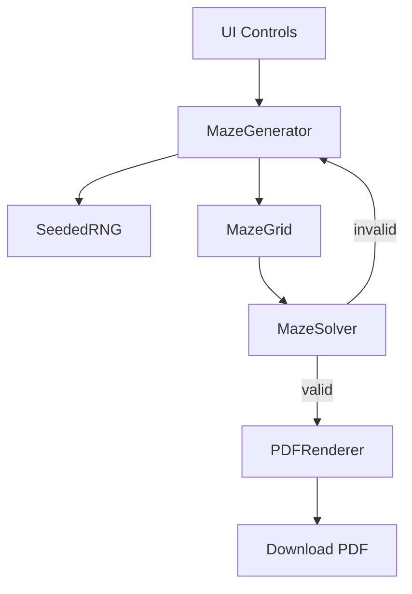

# v0 Implementation Plan — Printable Maze Generator

**Status:** approved  
**Last updated:** 2026-01-31  
**Owner:** Agent  
**Related:** [v0_spec.md](.cursor/plans/v0_spec.md)

---

## Overview

Build a local, offline web app that generates print-ready PDF maze packs. Users select age range, style, theme, and quantity, then download a single PDF with N mazes.

---

## Scope

**In scope:**

- Seeded maze generation (Prim's algorithm)
- Two difficulty presets (3-5, 9-13) with scaled grid size, cell size, line thickness
- Square and rounded-corner maze styles
- Theme decorations (shapes, animals) — corner/edge icons only
- PDF generation with vector paths
- Start/finish labels (arrows for young ages, text for older)
- Maze validation (solver)
- Debug mode (hidden toggle)

**Out of scope:**

- Persistence, accounts, cloud
- AI features
- Custom seed input (display-only in debug)
- Items in [DEFERRED_IDEAS.md](docs/DEFERRED_IDEAS.md)

---

## Technical Stack (Recommended)

- **Frontend:** Vanilla JS + Vite (minimal, inspectable, one command to run)
- **PDF:** pdf-lib (modern, pure JS, vector-first)
- **Maze Algorithm:** Prim's (deterministic, short dead-ends, forgiving for all ages)
- **RNG:** Seeded PRNG (mulberry32 or similar)
- **Testing:** Vitest (unit), Playwright (E2E smoke)

**Rationale:** Spec emphasizes "clean, inspectable demonstration" and minimal tooling. Vanilla JS avoids framework overhead. pdf-lib has excellent vector support for crisp print output. Prim's algorithm produces mazes with short branching dead-ends, making them more intuitive to solve for younger children.

---

## Architecture




**File structure:**

```
/src
  index.html
  main.js              # App entry, UI wiring
  /maze
    generator.js       # Prim's algorithm
    solver.js          # BFS pathfinder
    grid.js            # Grid data structure
  /pdf
    renderer.js        # pdf-lib integration
    layout.js          # Page layout, margins
  /themes
    shapes.js          # Shape decorations
    animals.js         # Animal decorations
  /utils
    rng.js             # Seeded PRNG
    constants.js       # Difficulty presets
  /styles
    main.css           # UI styles
/tests
  maze.test.js
  solver.test.js
  pdf.test.js
package.json
vite.config.js
README.md
/docs
  DECISIONS.md
  DEFERRED_IDEAS.md
```

---

## Checkpoints

### C0 — Project scaffold + smoke test

- Initialize Vite project with vanilla JS template
- Create file structure
- Basic HTML with placeholder UI
- `npm run dev` serves app
- **Validation:** App loads, no errors in console

### C1 — Seeded maze generation

- Implement seeded PRNG (`rng.js`)
- Implement grid data structure (`grid.js`)
- Implement Prim's algorithm (`generator.js`)
- Difficulty presets for 3-5 and 9-13 age bands:
  - Grid size (fewer cells = easier)
  - Cell size (larger = easier to trace)
  - Line thickness (thicker = easier to see)
- **Validation:** Same seed + params = identical maze (unit test)

### C2 — Maze solver + validation

- Implement BFS solver (`solver.js`)
- Validate maze has exactly one solution
- Regenerate on invalid maze
- **Validation:** Solver finds path for all generated mazes (unit test)

### C3 — PDF rendering

- Integrate pdf-lib
- Render maze grid as vector paths
- Square corners (default) and rounded corners (style option)
- US Letter layout with 0.5" margins
- Start/finish labels:
  - Ages 3-8: entry arrow, exit arrow
  - Ages 9+: "Start" text, "Finish" text
- Footer: "Generated with MakerNik Maze Tool / makernik.com"
- **Validation:** PDF opens correctly, prints crisp

### C4 — UI controls + styling

- Age range selector (4 options, maps to 2 presets)
- Maze style toggle (square corners / rounded corners)
- Theme selector (none/shapes/animals)
- Quantity stepper (1-10, default 5)
- Generate button
- UI layout and styling per user guidelines (to be provided)
- **Validation:** All controls functional, PDF generates

### C5 — Themes (decorative)

- Shape decorations (corner/edge icons only)
- Animal decorations (corner/edge icons only)
- No icons inside maze area
- No silhouette-constrained paths
- **Validation:** Themes render in PDF corners/edges, maze grid unaffected

### C6 — Debug mode

- Hidden toggle (e.g., Ctrl+Shift+D or URL param)
- Expose: difficulty params, seed (read-only), solver overlay
- Quantity default: 1 in debug mode
- **Validation:** Debug mode toggles correctly, seed visible

### C7 — Error handling + polish

- Inline error on repeated generation failure
- Console logging (no UI stack traces)
- Final UI polish
- **Validation:** Error states handled gracefully

### C8 — Tests + documentation

- Unit tests: generator, solver, RNG determinism
- E2E smoke test: generate PDF flow
- Update README with usage instructions
- Record any decisions in DECISIONS.md
- **Validation:** All tests pass, README accurate

---

## Validation

**Tests to add:**

- `maze.test.js`: Deterministic generation, grid integrity
- `solver.test.js`: Path found, single solution
- `rng.test.js`: Same seed = same sequence
- `pdf.test.js`: PDF generates without error

**Commands to run:**

```bash
npm run dev        # Dev server
npm run build      # Production build
npm run test       # Unit tests
npm run test:e2e   # E2E tests
```

**Pass criteria:**

- Same seed + params = identical PDF output
- All mazes solvable with single solution
- PDF opens in standard viewers, prints crisp
- App works offline after initial load
- No network calls at runtime

---

## Notes / Risks

- **pdf-lib bundle size:** ~250KB. Acceptable for offline-first app.
- **Theme SVG complexity:** Keep decorations simple; complex paths may slow rendering.
- **Browser print differences:** Test on Chrome, Firefox, Safari.
- **RNG edge cases:** Ensure determinism across browsers (use well-tested PRNG).

---

**Next review:** After C0 approval